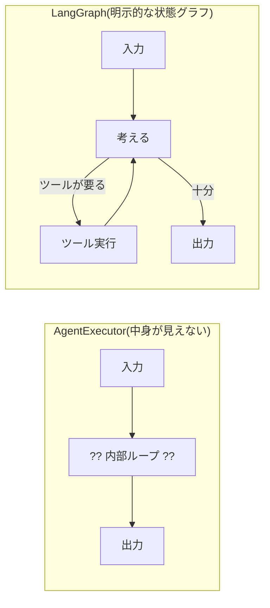

## このセクションで学ぶこと

- フローを「状態 + ノード + エッジ」のグラフとして表す発想を理解する
- グラフ表現がブラックボックスなループと何が違うのかを説明できる
- State がフロー全体で共有される「作業メモ」であることをイメージできる

## 隠れたループを「目に見える地図」にする

前のセクションで、`AgentExecutor` は制御フローを内部に隠してしまうと述べました。LangGraph の発想はこれを逆転させます。**処理の流れを、開発者が読み書きできる「グラフ」として外に出す**のです。

グラフは 3 つの要素でできています。

- **State(状態)**: フロー全体で共有される作業メモ。会話履歴、途中の計算結果、再試行の回数などをここに溜めていきます。
- **ノード(Node)**: 一つひとつの処理。「LLM に考えさせる」「ツールを呼ぶ」「結果を整形する」といった作業の単位です。State を受け取り、更新して返します。
- **エッジ(Edge)**: ノードからノードへ進む矢印。「このノードの次はこのノードへ」という遷移を定義します。

つまり LangGraph では、フローを「どんなデータ(State)を、どの処理(Node)が、どういう順番(Edge)で触っていくか」という地図として描きます。ループも分岐も、地図の上に矢印として明示的に現れます。

## ブラックボックスとの対比

下の図は、内部にループを隠した `AgentExecutor` と、流れを明示するグラフを並べたものです。左は中身が見えず、右はどのノードを通りどこで分岐するかが一目で分かります。



右のグラフでは、`考える` ノードから「ツールが要るなら `ツール実行` へ、十分なら `出力` へ」という分岐が矢印として見えています。`ツール実行` から `考える` へ戻る矢印がループです。これらは LLM の気まぐれではなく、**こちらが定義した遷移**として確実に動きます。

## State が流れをつなぐ

ここで重要なのは、ノードどうしが直接データを手渡しするのではなく、**全員が同じ State を読み書きする**点です。たとえば `考える` ノードが「次に呼ぶツール」を State に書き込み、`ツール実行` ノードがそれを読んで実行し、結果をまた State に書き戻す、という具合です。

```python
# State は「作業メモ」。各ノードがこれを更新していく
class State(TypedDict):
    messages: list      # 会話履歴
    next_tool: str       # 次に呼ぶツール
    retry_count: int     # 再試行した回数
```

State を中心に据えることで、「いま何回再試行したか」「途中結果はどうなっているか」がいつでも観測でき、分岐やループの条件にそのまま使えます。これが、隠れたループにはなかった透明性です。

## 注意点 — グラフ化は「全部やる」必要はない

すべてのフローをグラフで書くべき、というわけではありません。一直線の単純な処理なら従来の Chain で十分です。グラフ表現が効いてくるのは、**分岐・ループ・途中介入**といった「素直な一本道では書けない」フローです。次のセクションで、どんなユースケースが該当するかを具体的に見ます。

## まとめ

- LangGraph はフローを「State + ノード + エッジ」のグラフとして外に出す。
- ブラックボックスなループと違い、分岐もループも矢印として明示され確実に動く。
- ノードは直接データを渡さず、共有 State を読み書きすることで流れをつなぐ。
