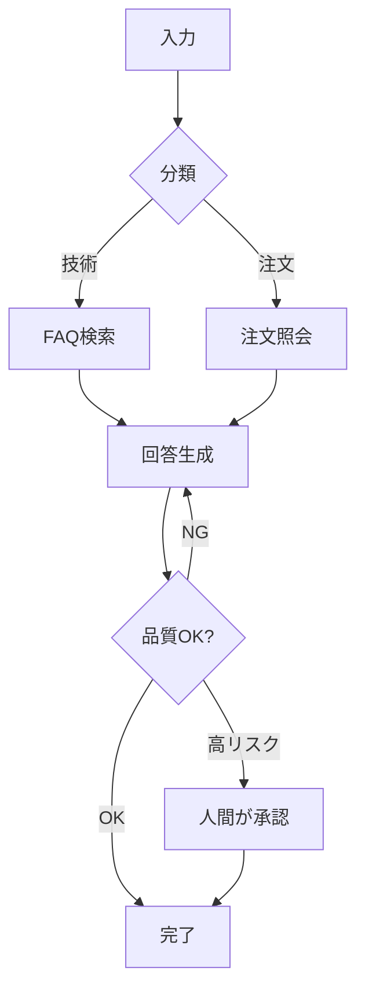

## このセクションで学ぶこと

- 分岐・ループ・人間の介在という3つの典型ユースケースを判断できる
- LangGraph が「向く場面」と「不要な場面」を切り分けられる
- 自分のアプリで LangGraph を使うべきかを判断する観点を持つ

## 向いている3つの典型パターン

LangGraph が真価を発揮するのは、「素直な一本道では書けないフロー」です。代表的なのは次の 3 パターンで、いずれも前のセクションで見た「制御を握りたい」場面に対応します。

### 1. 条件分岐 — 状態で進路を変える

State の値を見て、次に進むノードを切り替えたいケースです。

- 問い合わせ内容を分類し、「技術的な質問なら FAQ 検索ノードへ、注文に関する質問なら注文照会ノードへ」振り分ける
- ユーザーの権限に応じて、実行できる操作のノードを切り替える

LLM に分類だけさせ、**実際の遷移はこちらが定義した条件で確実に行う**のがポイントです。

### 2. ループ — 満足するまで反復する

同じ処理を、条件を満たすまで繰り返したいケースです。

- 生成したコードをテストし、失敗したらエラーを添えて再生成。成功するか最大回数に達するまで反復する
- 下書き → 自己レビュー → 修正、を品質が基準を超えるまで回す(リフレクション)

State に再試行回数や評価スコアを持たせ、それを終了条件に使います。

### 3. human-in-the-loop — 人間を途中に挟む

自動で進めず、要所で人間の判断を待ちたいケースです。

- 高額な決済・外部へのメール送信・データ削除の直前で止め、承認を待つ
- AI の下書きを人間が修正してから次の工程へ渡す

「止めて、待って、再開する」を確実に行うには、状態を保存できる仕組みが要ります。これは第5章で詳しく扱います。

この図 1 枚に、分岐(`分類`)・ループ(`回答生成` への戻り)・人間の介在(`人間が承認`)がすべて含まれています。LangGraph はこうした複合的なフローを 1 つのグラフで素直に表現できます。

## 注意点 — 使わない判断も大切

一方で、LangGraph が不要な場面もはっきりしています。

- **一直線の処理**: 「プロンプトを整形 → LLM 呼び出し → 結果を返す」だけなら、従来の Chain(LCEL)のほうが簡潔です。
- **単純な自律エージェント**: ツールを自由に使わせたいだけで、分岐や介入の制御が要らないなら、フルにグラフを組む必要はありません。この用途はかつて `AgentExecutor` が担っていましたが、現在は legacy(`langchain-classic`)扱いで、標準は `create_agent` や LangGraph のプリビルト(`create_react_agent`)です。

判断の目安はシンプルです。「**分岐・ループ・人間の介在のうち、どれか一つでも確実に制御したいか**」。一つでも該当すれば LangGraph の出番、どれも要らなければ過剰投資になりかねません。

## まとめ

- LangGraph が向くのは「条件分岐」「ループ(再試行・反復改善)」「human-in-the-loop」の 3 パターン。
- これらは 1 つのグラフに混在させて素直に表現できる。
- 一直線の処理や単純な自律エージェントには不要。制御したい要素があるかで判断する。
