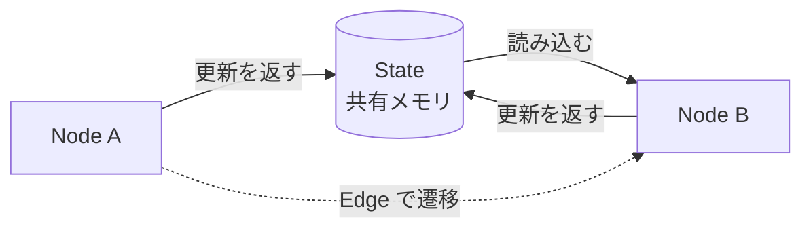

## このセクションで学ぶこと

- State がグラフ全体で共有される「働くメモリ」であることを理解する
- TypedDict を使って State のスキーマを型付きで定義する方法を説明できる
- State・Node・Edge という 3 つの構成要素の関係をつかむ

## State はグラフ全体で共有される「働くメモリ」

第 1 章で、LangGraph はフローを「状態 + ノード + エッジ」のグラフで表す、という発想を見ました。この章では、その 3 要素を一つずつ具体的に組み立てていきます。最初は **State(状態)** です。

State は、グラフ全体で共有される 1 つのデータの入れ物です。各ノードはこの State を受け取って処理し、更新した内容を返します。エッジはノード間の遷移を決めるだけで、データそのものは常に State を通じて受け渡されます。つまり State は、フロー全体を貫いて流れていく **働くメモリ** だと考えると分かりやすいでしょう。



ユーザーの入力、途中で呼んだツールの結果、これまでの会話履歴、ループの試行回数 ── こうした「フローを進めるために覚えておきたいもの」はすべて State に持たせます。LangChain の `AgentExecutor` ではこうした状態が内部に隠れていましたが、LangGraph では State として自分で明示的に設計します。

## TypedDict でスキーマを定義する

State がどんなキーを持つかは、あらかじめ **スキーマ** として定義します。もっとも基本的な方法は、Python 標準の `TypedDict` を使うやり方です。

```python
from typing import TypedDict

class State(TypedDict):
    question: str       # ユーザーからの質問
    context: str        # 検索などで集めた参考情報
    answer: str         # 最終的な回答
```

この `State` は「`question`・`context`・`answer` という 3 つのキーを持ち、それぞれ文字列である」というスキーマを表します。後でグラフを組み立てるとき、この型を `StateGraph(State)` のように渡すことで、LangGraph は「このグラフが扱う状態の形」を把握します。

型ヒントとして書くので、エディタの補完や型チェックが効くのも実務上の利点です。State にどんな情報が乗っているかがコードを読むだけで分かり、ノード関数を書くときの手がかりになります。

## 注意点 ── State は「設計」する対象

State は単なる変数置き場ではなく、**フローの設計そのもの**です。最初に「このフローを完成させるには、途中でどんな情報を覚えておく必要があるか」を洗い出すと、自然とキーが決まります。逆に State の設計を曖昧にすると、ノードが必要な情報を取り出せなかったり、どこで何が書き込まれるか追えなくなったりします。

なお `TypedDict` はあくまで型の宣言で、実行時に厳密な型チェックを強制するものではありません。型はチームでの読みやすさと開発支援のための「約束ごと」と捉え、まずは扱う情報を素直にキーとして並べることから始めましょう。

## まとめ

- State はグラフ全体で共有される「働くメモリ」で、ノード間のデータはすべて State 経由で受け渡される。
- State のスキーマは `TypedDict` で型付きに定義し、`StateGraph` に渡す。
- State 設計はフロー設計そのもの。覚えておきたい情報をキーとして洗い出すことから始める。
