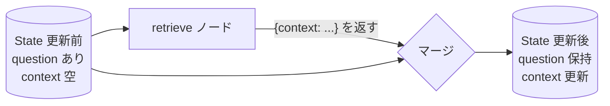

## このセクションで学ぶこと

- Node が State を受け取り、更新分の辞書を返す関数であることを理解する
- 返した部分更新だけが State にマージされる仕組みを把握する
- ノード関数を純粋に保つことの実務上の利点を説明できる

## Node は「State を受け取り、更新を返す」関数

State という共有メモリを用意したら、次はそれを処理する **Node(ノード)** です。LangGraph のノードは、難しいものではありません。**State を引数に受け取り、更新したい内容を辞書で返す関数**です。

```python
def retrieve(state: State) -> dict:
    question = state["question"]
    context = search_documents(question)   # 何らかの検索処理
    return {"context": context}
```

この `retrieve` ノードは、State から `question` を読み取り、検索結果を `context` に書き込みたい、という意図を持ちます。重要なのは、**State 全体を返すのではなく、更新したいキーだけを返す**点です。ここでは `context` だけを返しており、`question` や `answer` には触れていません。

## 返した分だけが State にマージされる

ノードが返した辞書は、LangGraph によって既存の State に **マージ**されます。返さなかったキーは元の値のまま保たれます。先ほどの `retrieve` の場合、戻り値 `{"context": ...}` によって State の `context` だけが更新され、`question` はそのまま次のノードへ引き継がれます。



このように、各ノードは「State の一部を埋める担当」として働きます。検索担当、要約担当、回答生成担当 ── と役割ごとにノードを分け、それぞれが自分の担当キーを更新していくことで、フロー全体が State を少しずつ育てていきます。

## 注意点 ── ノードは純粋に保つ

ノード関数は、できるだけ **純粋関数**に近づけるのが実務上の鉄則です。つまり、引数の State を直接書き換えず、戻り値の辞書で更新を表現します。`state["context"] = ...` のように引数を直接いじるのではなく、`return {"context": ...}` と返すスタイルを徹底しましょう。

こうしておくと、ノード単体を「入力 State を渡して戻り値を確認する」だけでテストできます。後の章で扱う分岐やループでも、各ノードが副作用を持たないほど挙動が予測しやすくなります。逆に引数を直接変更すると、どこで State が変わったのか追えなくなり、デバッグが難しくなります。

## まとめ

- Node は State を受け取り、更新したいキーだけを辞書で返す関数。
- 返した部分更新だけが State にマージされ、返さなかったキーは保持される。
- 引数を直接書き換えず戻り値で更新を表す「純粋な」スタイルが、テストとデバッグを容易にする。
