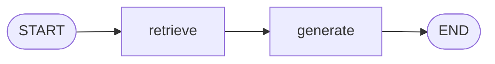

## このセクションで学ぶこと

- Edge がノード間の遷移(実行順序)を定義することを理解する
- `add_edge` で固定の遷移を、`START` / `END` で開始と終了をつなぐ方法を把握する
- Edge はデータではなく「次にどこへ進むか」だけを決めることを理解する

## Edge は「次にどのノードへ進むか」を決める

State(共有メモリ)と Node(更新する関数)が揃ったら、最後に **Edge(エッジ)** でノード同士をつなぎます。エッジは「あるノードが終わったら、次にどのノードを実行するか」という **遷移**を定義します。

ここで大事なのは、エッジが運ぶのは **制御の流れだけ**だという点です。データは常に State を通じて受け渡されるので、エッジ自体は値を持ちません。エッジは「処理の順番」を決める矢印だと考えてください。前のセクションのノードが State を育てる担当だとすれば、エッジは「その担当をどの順に呼ぶか」を決める役です。

## add_edge で固定の遷移を作る

もっとも基本的なエッジは、`add_edge` による固定の遷移です。`add_edge("retrieve", "generate")` と書けば、「`retrieve` ノードが終わったら必ず `generate` ノードを実行する」という一本道の矢印になります。

グラフには開始点と終了点も必要です。LangGraph では `START` と `END` という特別なノードが用意されています。`START` から最初のノードへエッジを引けばそこが **エントリポイント**になり、最後のノードから `END` へエッジを引けばそこでフローが終わります。

```python
from langgraph.graph import StateGraph, START, END

builder = StateGraph(State)
builder.add_node("retrieve", retrieve)
builder.add_node("generate", generate)

builder.add_edge(START, "retrieve")        # 開始 → retrieve
builder.add_edge("retrieve", "generate")   # retrieve → generate
builder.add_edge("generate", END)          # generate → 終了
```



この例では「開始 → 検索 → 回答生成 → 終了」という一直線のフローができあがります。各ノードは State を順に更新し、最終的に `END` に到達した時点の State が結果になります。

## 注意点 ── エッジとノードの名前は一致させる

エッジは **ノードの名前(文字列)**で接続を指定します。`add_node` で登録した名前と、`add_edge` で参照する名前が食い違うと、グラフの compile 時にエラーになります。タイプミスや、ノードを後からリネームしたときの取りこぼしに注意しましょう。

また、ここで扱った `add_edge` は「必ずこの順で進む」固定遷移です。State の中身に応じて行き先を切り替えたい場合は、第 4 章で扱う **条件分岐エッジ(conditional edge)** を使います。本章ではまず、一本道のエッジでグラフの骨格を組めるようになることを目標とします。

## まとめ

- Edge はノード間の遷移(実行順序)を定義し、運ぶのは制御の流れだけ。データは State 経由。
- `add_edge` で固定の遷移を、`START` / `END` で開始点と終了点を接続する。
- エッジはノード名(文字列)で接続するため、`add_node` の名前と一致させる。
