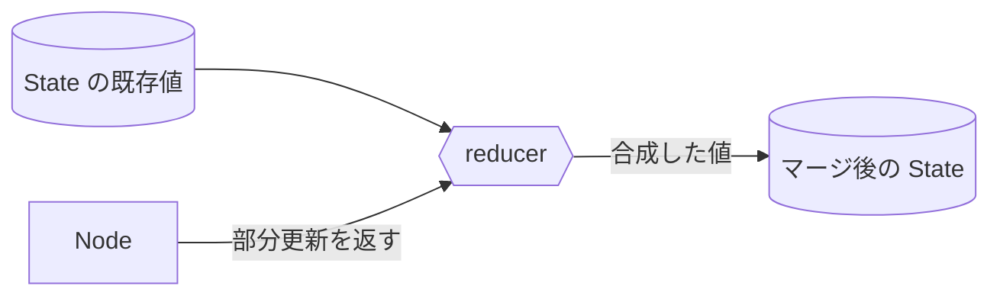

## このセクションで学ぶこと

- reducer がノードの戻り値を既存 State にどうマージするかを決める関数であることを理解する
- 既定のマージは「上書き」で、追記したいキーには reducer を指定することを把握する
- `Annotated` と `add_messages` を使って会話履歴を蓄積する典型パターンを説明できる

## reducer は「更新をどう合成するか」を決める

前のセクションで、ノードは更新したいキーだけを辞書で返し、それが State に **マージ**されると学びました。では、そのマージは具体的にどう行われるのでしょうか。ここを決めるのが **reducer(リデューサ)** です。

reducer は「既存の値」と「ノードが新しく返した値」を受け取り、合成後の値を返す関数です。キーごとに指定でき、何も指定しなければ既定の挙動として **新しい値で上書き**します。`State` を `TypedDict` で素直に定義した場合は、すべてのキーがこの「上書き」になります。



つまりノードが `{"context": "..."}` を返せば、`context` の既存値は捨てられ新しい値に置き換わります。多くのキーはこれで十分です。

## 上書きでは困るとき ── reducer を指定する

問題は「**前の値に積み上げたい**」ケースです。たとえば会話履歴のメッセージ一覧は、ノードが発言するたびに上書きされては困ります。新しいメッセージを **追記**したいわけです。

そこで、キーに reducer を結びつけます。`Annotated` を使って「この型のキーは、この reducer でマージする」と宣言します。会話履歴には LangGraph 組み込みの `add_messages` がよく使われます。

```python
from typing import Annotated, TypedDict
from langgraph.graph.message import add_messages

class State(TypedDict):
    question: str                                   # 上書き(既定)
    messages: Annotated[list, add_messages]         # 追記でマージ
```

この `State` では、`question` は従来どおり上書きされますが、`messages` は `add_messages` によって **既存リストに新しいメッセージが追加**されます。ノードが `{"messages": [new_msg]}` を返すと、過去のメッセージを保ったまま末尾に積まれます。リストを足し合わせる単純な reducer として `operator.add` を使うパターンもありますが、メッセージ列なら ID で重複を解決してくれる `add_messages` の方が安全です。

## 注意点 ── 上書きと追記を取り違えない

reducer 設計でよくある事故は、追記したいキーに reducer を付け忘れて履歴が消えてしまう、あるいは逆に上書きで十分なキーに `add` 系を付けてしまい値がどんどん膨らむ、という取り違えです。State のキーごとに「ここは最新値だけでよいか、積み上げが必要か」を最初に決めておきましょう。

迷ったら「次のノードはこのキーの過去の値を必要とするか」を考えると判断できます。必要なら reducer で蓄積、不要なら既定の上書きで構いません。reducer は State 設計の最後のひと押しであり、ここを正しく決めるとループや分岐を含むフローでも状態が破綻しなくなります。

## まとめ

- reducer はノードの部分更新を既存 State とどう合成するかを決め、既定は「上書き」。
- 追記が必要なキーは `Annotated[型, reducer]` で reducer を指定する。
- 会話履歴は `add_messages` で蓄積するのが定番。キーごとに上書きか追記かを設計する。
