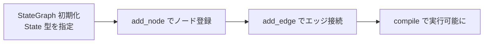

## このセクションで学ぶこと

- `StateGraph` を State の型を指定して初期化する
- `add_node` でノードを名前付きで登録する
- `add_edge` でノード間の遷移を接続する

## StateGraph は「組み立て用の容器」

第 2 章では State・Node・Edge という 3 つの部品を個別に学びました。本セクションでは、それらを 1 つのグラフへ組み上げる入れ物である `StateGraph` を扱います。`StateGraph` は、State の型を受け取り、そこへノードとエッジを順番に登録していくためのクラスです。

まず、State の型を渡してインスタンスを作ります。この型が、グラフ全体で受け渡される状態の構造を決めます。

```python
from typing import TypedDict
from langgraph.graph import StateGraph

class State(TypedDict):
    question: str
    answer: str

builder = StateGraph(State)
```

ここで作った `builder` はまだ「設計図を書き込む台紙」にすぎません。ノードもエッジも空の状態です。実行できるグラフにするには、このあと部品を登録し、最後に `compile()` する必要があります(compile は本章 03-03 で扱います)。

## ノードを登録し、エッジでつなぐ

ノードは「名前」と「関数」のペアで登録します。第 2 章で学んだとおり、ノード関数は State を受け取り、更新したい部分だけを辞書で返します。`add_node` の第 1 引数がグラフ内での名前で、第 2 引数が実体の関数です。

```python
def retrieve(state: State) -> dict:
    return {"answer": f"{state['question']} への回答候補"}

def finalize(state: State) -> dict:
    return {"answer": state["answer"] + "(確定)"}

builder.add_node("retrieve", retrieve)
builder.add_node("finalize", finalize)

builder.add_edge("retrieve", "finalize")
```

`add_edge("retrieve", "finalize")` は「`retrieve` が終わったら必ず `finalize` へ進む」という固定の遷移を意味します。構築の流れは次のように整理できます。



## 注意点

ノード名はグラフ内で一意です。同じ名前で `add_node` すると上書き・衝突の原因になります。また、エッジで指定するノード名は、必ず先に `add_node` で登録済みである必要があります。タイポした名前を `add_edge` に渡すと、compile 時にエラーになります。

## まとめ

- `StateGraph(State)` で State の型を指定して組み立て用の容器を作る。
- `add_node("名前", 関数)` でノードを、`add_edge("from", "to")` で固定遷移を登録する。
- エッジで使うノード名は登録済みであること、名前は一意であることに注意する。
