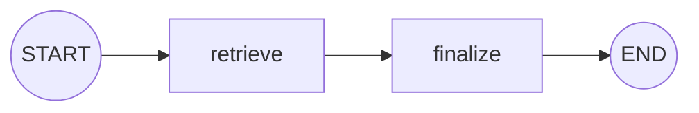

## このセクションで学ぶこと

- `set_entry_point` でグラフの開始ノードを指定する
- `END` へのエッジでグラフの終了を表す
- 開始と終了を欠くと実行できないことを理解する

## グラフには「入口」と「出口」が要る

前のセクションでノードとエッジを登録しましたが、それだけではグラフを実行できません。実行エンジンは「どのノードから始めるのか」「どこで終わるのか」を知らないからです。この入口がエントリポイント、出口が `END` です。

エントリポイントは `set_entry_point` で指定します。これは「実行を始めたら、まずこのノードを呼ぶ」という宣言です。

```python
builder.set_entry_point("retrieve")
```

同じことを、特別なノード `START` からのエッジとして書くこともできます。次の 2 行は等価です。

```python
from langgraph.graph import START

builder.add_edge(START, "retrieve")
```

## END で実行を止める

出口は `END` という特別なノードへのエッジで表します。あるノードから `END` へエッジを張ると、そのノードの実行後にグラフ全体が停止し、最終的な State が呼び出し元へ返ります。

```python
from langgraph.graph import END

builder.add_edge("finalize", END)
```

入口・本体・出口の関係は次のとおりです。`START` と `END` はノードのように見えますが、関数を持たない目印である点が普通のノードと異なります。



## 注意点

エントリポイントを指定し忘れると、グラフは「どこから始めればよいか」が決まらず compile 時にエラーになります。同様に、どのノードからも `END` に到達できない場合、ループから抜けられず実行が止まらない原因になります(ループの安全な止め方は第 4 章で扱います)。`START` / `END` は `langgraph.graph` からインポートして使う定数で、自分で `add_node` する対象ではない点に注意してください。

## まとめ

- 開始ノードは `set_entry_point` か `START` からのエッジで指定する。
- 終了は `END` へのエッジで表し、到達するとグラフが停止して最終状態が返る。
- 入口を欠くと compile エラー、出口へ到達できないと実行が止まらない。
