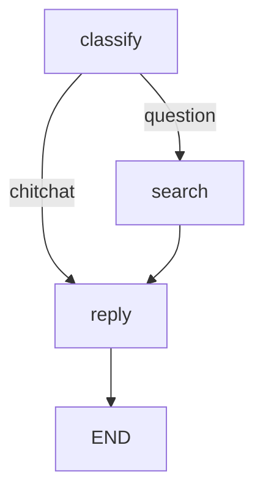

## このセクションで学ぶこと

- conditional edge が State を見て次のノードを選ぶ仕組みを理解する
- 遷移先を返すルーティング関数の書き方を知る
- `add_conditional_edges` のマッピング指定を使い分ける

## 状態に応じて道を分けるのが conditional edge

第 3 章で扱った `add_edge` は、あるノードから次のノードへ必ず一本道で進む「固定エッジ」でした。しかし実務のフローでは「入力が質問なら検索ノードへ、雑談なら返答ノードへ」のように、**そのときの State の中身によって行き先を変えたい**場面が多くあります。これを実現するのが conditional edge(条件分岐エッジ)です。

conditional edge の中心にあるのは **ルーティング関数** です。これは現在の State を受け取り、「次にどのノードへ行くべきか」を表す文字列を返すだけの関数です。グラフ自体は分岐の判断ロジックを持たず、判断はこの関数に閉じ込めます。State と遷移を分離できるため、分岐条件を変えたいときはルーティング関数だけを直せばよく、テストもしやすくなります。



## 具体例:入力種別でノードを振り分ける

次の例では `classify` ノードの後に conditional edge を置き、ルーティング関数 `route` が State の `kind` を見て遷移先キーを返します。返ったキーは `add_conditional_edges` の第 3 引数(マッピング)で実際のノード名へ変換されます。

```python
from langgraph.graph import StateGraph, END

def route(state: State) -> str:
    # State を見て分岐キーを返すだけ。遷移自体はグラフが行う
    return "search" if state["kind"] == "question" else "reply"

builder.add_conditional_edges(
    "classify",          # 分岐元のノード
    route,               # ルーティング関数
    {                    # 戻り値 → 遷移先ノードのマッピング
        "search": "search",
        "reply": "reply",
    },
)
```

マッピングを省略してルーティング関数がノード名そのものを返す書き方もできますが、**分岐キーと実ノード名を分けておくほうが、後でノードを差し替えても関数を変えずに済む**ため実務では推奨です。終了させたい分岐では遷移先に `END` を指定します。

## 注意点

- ルーティング関数は **State を読むだけ**にして、副作用(API 呼び出しや State の書き換え)を入れないでください。判断と更新を混ぜると追いにくくなります。
- マッピングに存在しないキーを返すと実行時エラーになります。戻り値の候補は有限の集合に限定し、想定外の値はデフォルト分岐へ寄せるのが安全です。
- 1 つの分岐元から複数キーを返すことはできません。**1 回の判断で 1 つの遷移先**である点を押さえておきましょう(複数同時起動は次節以降の fan-out で扱います)。

## まとめ

- conditional edge は State を見て次のノードを動的に選ぶエッジで、判断はルーティング関数に閉じ込める。
- `add_conditional_edges` は分岐元ノード・ルーティング関数・遷移先マッピングの 3 点で登録する。
- 分岐キーと実ノード名を分け、想定外の戻り値はデフォルトへ寄せると安全。
