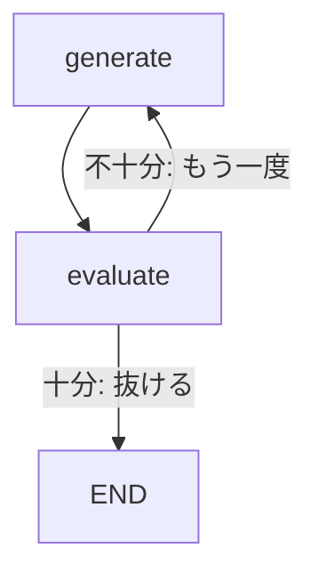

## このセクションで学ぶこと

- ノードへ戻るエッジでループ(再試行・反復)を構成する方法を理解する
- ループの継続・終了を conditional edge の判定で決める
- 反復回数を State に持たせて終了条件を設計する

## グラフは後ろへも戻れる

Chain や単純な DAG では処理は前へ進むだけですが、LangGraph のグラフは **過去に通ったノードへ戻るエッジ**を張れます。これがループです。「生成 → 評価 → ダメなら生成へ戻る」「ツール呼び出し → 結果が不十分なら再検索」のような**再試行・反復**は、ループとして自然に表現できます。

ループは前節の conditional edge と組み合わせて作ります。反復の本体となるノードの後に conditional edge を置き、ルーティング関数が **「もう一度ループする」か「抜ける」か**を State から判定します。継続なら本体ノードへ戻すエッジを、終了なら `END` や次工程へのキーを返します。



## 具体例:品質を満たすまで生成を繰り返す

State に試行回数 `attempts` と現在の出来 `score` を持たせ、`should_continue` で継続判定します。継続のときは `generate` へ戻るので、図の左向きエッジが成立します。

```python
def should_continue(state: State) -> str:
    if state["score"] >= 0.8:
        return "done"
    return "retry"

builder.add_conditional_edges(
    "evaluate",
    should_continue,
    {
        "retry": "generate",   # ループ:本体ノードへ戻す
        "done": END,           # 終了:抜ける
    },
)
```

`generate` ノード側では、State の `attempts` を 1 増やして返すようにしておきます(reducer の挙動は §2-04 参照)。こうして「何回試したか」が State に蓄積され、終了条件の判定材料になります。

## 注意点

- **終了条件を必ず用意する**こと。ルーティング関数がいつまでも `retry` を返すとループが止まりません。回数上限やスコア閾値など、有限で抜ける条件を入れます。
- 終了条件があっても、バグや想定外の入力で抜けられない場合に備え、LangGraph は `recursion_limit` で実行ステップ数に上限を設けています(§4-04 で詳述)。これは保険であって、終了条件の代わりではありません。
- ループ本体のノードは **State を上書きではなく更新**する設計にすると、反復のたびに値が積み上がり、進捗を追えます。

## まとめ

- ループは過去のノードへ戻るエッジで作り、継続・終了は conditional edge で判定する。
- 反復回数や品質スコアを State に持たせ、有限で抜ける終了条件を必ず設計する。
- `recursion_limit` は暴走を止める保険であり、終了条件の代替ではない。
