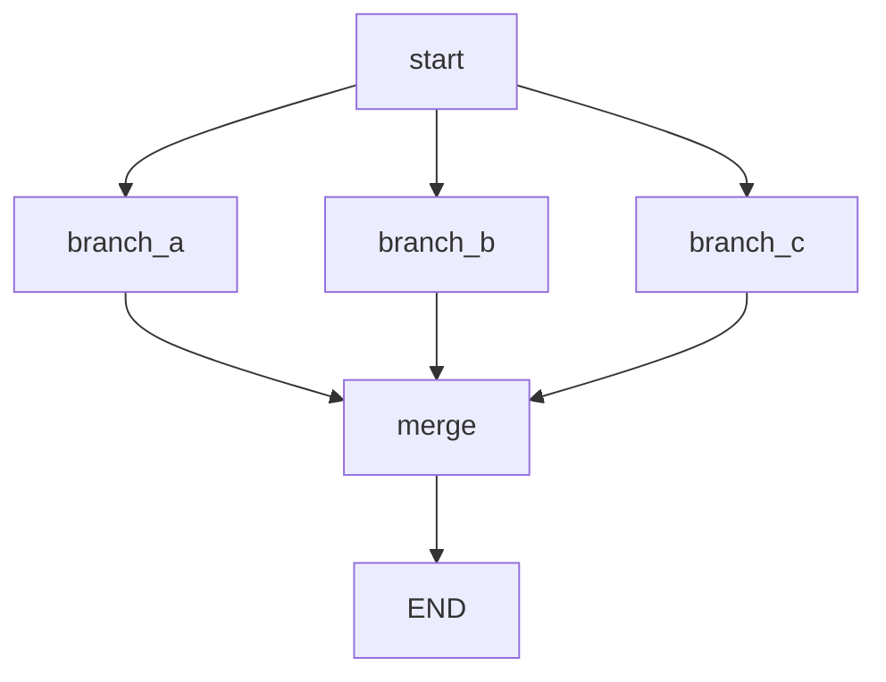

## このセクションで学ぶこと

- 複数の分岐を 1 つのノードへ合流させる設計を理解する
- fan-out で複数ノードを並行して起動する考え方を知る
- fan-in で並行結果を reducer でまとめる必要性を理解する

## 分かれた道を 1 本にまとめる「合流」

§4-01 では State に応じて道を分けました。分けた後は、多くの場合どこかで **合流** させて共通の後処理(整形・応答生成など)に進みます。合流は特別な API ではなく、**複数のノードから同じ後続ノードへ `add_edge` を張るだけ**で成立します。下の図のように `branch_a`・`branch_b`・`branch_c` から同じ `merge` ノードへつなげば、どの経路を通っても `merge` に集まります。



## fan-out:複数ノードを並行して起動する

合流の手前で「1 つのノードから複数のノードへ同時に進めたい」ことがあります。たとえば 1 つの質問を **3 つの検索エンジンに並行投入**するようなケースです。1 つのノードから複数ノードへエッジを張ると、LangGraph はそれらを**同じステップで並行的に起動**します。これが fan-out(扇形に広げる)です。

```python
# 1 ノードから複数ノードへエッジを張ると並行起動される(fan-out)
builder.add_edge("dispatch", "search_web")
builder.add_edge("dispatch", "search_docs")
builder.add_edge("dispatch", "search_db")
```

## fan-in:並行結果を reducer でまとめる

並行したノードはそれぞれ State を更新して返します。それらを集約するノード(fan-in 先)では、**同じキーへの複数の更新が衝突しないよう reducer を設計**しておく必要があります。典型は結果を**リストに追記する** reducer です。

```python
import operator
from typing import Annotated

class State(TypedDict):
    # 複数ノードからの結果を append で集約する(§2-04 の reducer)
    results: Annotated[list, operator.add]
```

`operator.add` を reducer に指定すると、並行ノードがそれぞれ `{"results": [...]}` を返したとき、上書きではなく結合されて全結果が `results` に集まります。reducer を指定しないと**最後に書いた値で上書きされ、他の結果が失われる**ため、fan-in では reducer がほぼ必須になります。

## 注意点

- 合流ノードは「全分岐が来る」とは限りません。conditional edge で 1 経路だけ通る合流と、fan-out で全経路が来る合流では、必要な reducer 設計が異なります。
- 並行ノードの**実行順序は保証されません**。順序に依存しない集約(リスト追記・件数加算など)にしておきます。
- 並行数が多いとループと相まってステップ数が膨らみます。`recursion_limit`(§4-04)の見積もりに含めて考えます。

## まとめ

- 合流は複数ノードから同じ後続ノードへエッジを張るだけで成立する。
- fan-out は 1 ノードから複数ノードへ分岐し並行起動、fan-in はその結果を 1 ノードへ集約する。
- fan-in では `operator.add` などの reducer で結果を結合し、上書きによる消失を防ぐ。
