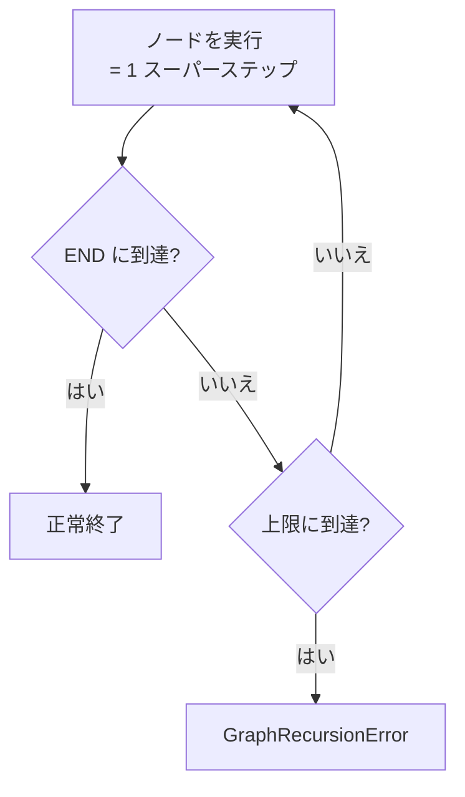

## このセクションで学ぶこと

- `recursion_limit` が実行ステップ数の上限であることを理解する
- 上限超過時に `GraphRecursionError` が送出される挙動を知る
- 終了条件と `recursion_limit` の役割の違いを区別する

## ループを暴走させないための安全装置

§4-02 で見たように、LangGraph はノードへ戻るエッジでループを作れます。便利な反面、終了条件のバグや想定外の入力でループが抜けられなくなると、グラフは延々と実行を続けてしまいます。これを防ぐための安全装置が `recursion_limit` です。

`recursion_limit` は、**1 回の実行で許容するステップ(スーパーステップ)数の上限**です。LangGraph はノードの実行を「スーパーステップ」という単位で数え、その回数がこの上限に達してもグラフが `END` に到達していない場合、実行を打ち切って `GraphRecursionError` を送出します。デフォルトは 25 です。つまり放置しても 25 ステップで必ず止まるため、無限ループによるコスト暴走やプロセスの占有を未然に防げます。



## 具体例:上限を指定して実行する

`recursion_limit` は実行時の `config` で指定します。再試行を多めに回したいループでは、終了条件が正しく働く前提でデフォルトより大きい値を設定します。

```python
# config の recursion_limit で上限を引き上げる
result = graph.invoke(
    {"input": "..."},
    config={"recursion_limit": 50},
)
```

上限に達して打ち切られたかどうかは、例外を捕捉して判断できます。再試行ループでは、上限超過をエラーとして扱うか、その時点までの最善結果を返すかを設計段階で決めておきます。

```python
from langgraph.errors import GraphRecursionError

try:
    result = graph.invoke(state, config={"recursion_limit": 50})
except GraphRecursionError:
    # 上限超過。ログ記録やフォールバック応答へ
    result = fallback_response(state)
```

## 注意点

- `recursion_limit` は **保険であって終了条件の代わりではありません**。正常系では必ず終了条件で `END` に到達する設計にし、`recursion_limit` はバグや異常入力の最後の防波堤として位置づけます。
- 並行ノード(§4-03 の fan-out)は **同じスーパーステップにまとめて数えられます**。ノードの総実行回数ではなくステップ数で数える点に注意してください。ループと fan-out を併用すると、見た目のノード数より早く上限へ近づくことがあります。
- 値を大きくするほど暴走時のコスト・待ち時間も増えます。ループの最大反復回数を見積もり、それに少し余裕を持たせた値を選ぶのが実務的です。

## まとめ

- `recursion_limit` は実行ステップ(スーパーステップ)数の上限で、超えると `GraphRecursionError` を送出する(デフォルト 25)。
- 実行時の `config` で指定し、超過時は例外を捕捉してフォールバックを設計する。
- あくまで暴走を止める保険であり、正常系は終了条件で `END` に到達させる。
