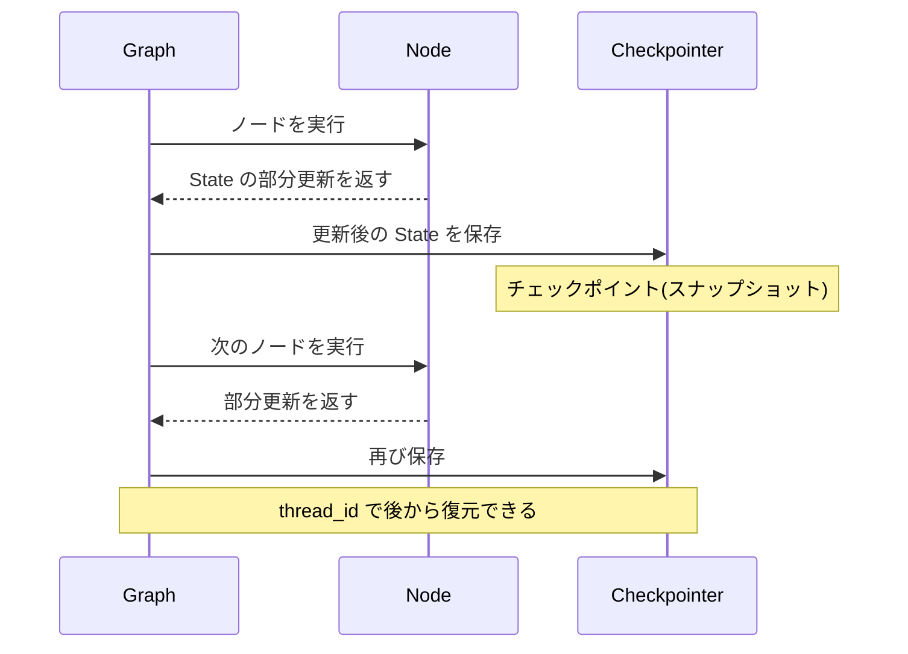

## このセクションで学ぶこと

- checkpointer がノード実行ごとに State のスナップショットを保存する仕組みを理解する
- compile 時に checkpointer を渡すと永続化が有効になることを理解する
- MemorySaver と SqliteSaver など保存先の使い分けを把握する

## チェックポイントとは何か

これまでの章では、グラフを `invoke` すると最初から最後まで一気に走り、終われば State はメモリから消えていました。しかし実務では「会話の続きを後で再開したい」「途中で落ちたところからやり直したい」「人間の確認を挟んで一旦止めたい」といった要求が出てきます。これらをすべて支えるのが **checkpointer** です。

checkpointer は、グラフが **ノードを 1 つ実行するたびに、その時点の State 全体をスナップショット(チェックポイント)として保存する**仕組みです。チェックポイントには State の中身に加えて「次にどのノードへ進む予定か」といった実行位置の情報も含まれます。そのため、保存された地点から後で正確に再開できます。



## 具体例:compile に checkpointer を渡す

永続化を有効にするのは簡単で、`compile` のときに checkpointer を渡すだけです。最も手軽なのはメモリ上に保持する `MemorySaver` です。

```python
from langgraph.checkpoint.memory import MemorySaver

checkpointer = MemorySaver()
app = graph.compile(checkpointer=checkpointer)
```

本番でプロセスをまたいで状態を残したい場合は、SQLite に保存する `SqliteSaver` や、PostgreSQL に保存する `PostgresSaver` を使います。インターフェースは共通なので、開発中は `MemorySaver`、本番は永続ストアと、差し替えるだけで移行できます。

```python
from langgraph.checkpoint.sqlite import SqliteSaver

with SqliteSaver.from_conn_string("checkpoints.sqlite") as checkpointer:
    app = graph.compile(checkpointer=checkpointer)
```

## 注意点

checkpointer を付けてグラフを実行するときは、**必ず `thread_id` を含む `config` を渡す**必要があります(渡さないとエラーになります)。thread_id は「どの会話・どのセッションのチェックポイントか」を区別するキーで、詳しくは次のセクションで扱います。

また `MemorySaver` はあくまでプロセスのメモリ上に持つだけなので、アプリを再起動すると消えます。デモやテストには十分ですが、本番の会話履歴を残したいなら SQLite や PostgreSQL のような永続ストアを選んでください。保存される State はそのまま記録に残るため、APIキーや個人情報など機微なデータを State に直接入れない設計も重要です。

## まとめ

- checkpointer はノード実行ごとに State のスナップショットを保存し、後から再開できるようにする。
- `compile(checkpointer=...)` で有効化し、実行時には thread_id を含む config が必須になる。
- 開発は MemorySaver、本番は SqliteSaver / PostgresSaver と用途で保存先を使い分ける。
