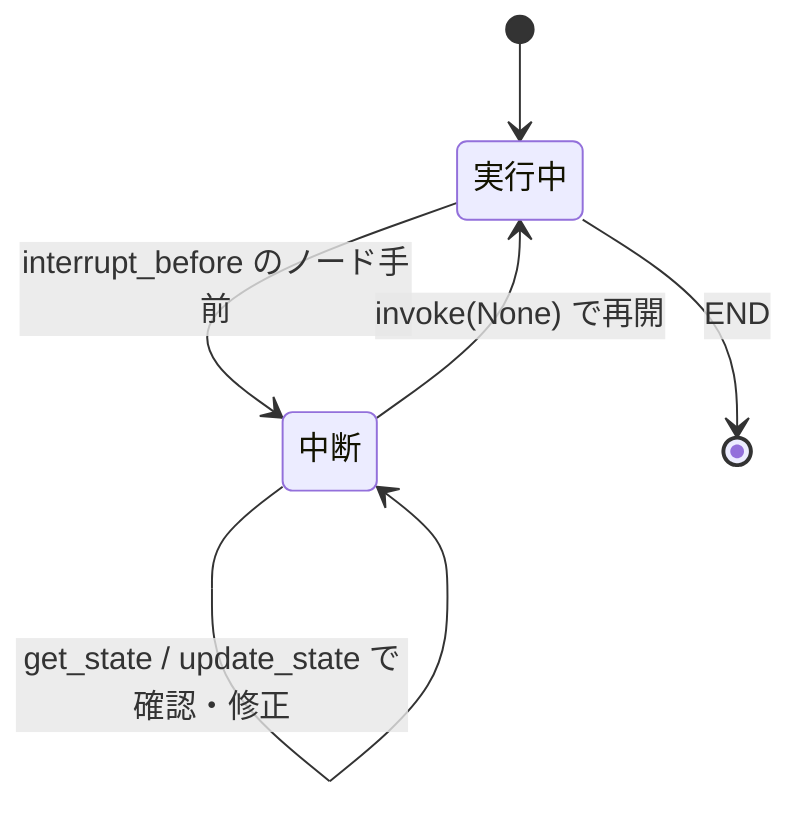

## このセクションで学ぶこと

- interrupt_before / interrupt_after で特定ノードの前後に実行を止められることを理解する
- 中断後に get_state で状態を確認し update_state で書き換えられることを理解する
- 入力 None で再 invoke すると中断地点から再開する仕組みを理解する

## なぜ実行を途中で止めるのか

checkpointer によってノードごとに State が保存されるようになると、「特定のノードの手前で一旦止め、人間が中身を確認してから先へ進める」ことが可能になります。たとえば、外部 API に課金が発生する処理や、メール送信・DB 更新のような取り返しのつかない操作の **直前で止めて承認を待つ**、といった使い方です。この「止める」仕組みが **interrupt** です。

interrupt は checkpointer があって初めて成立します。止めた時点の State がチェックポイントとして保存されているからこそ、後でその地点から再開できるのです。

## 具体例:ノードの前で止めて再開する

中断ポイントは `compile` のときに `interrupt_before`(または `interrupt_after`)で指定します。

```python
app = graph.compile(
    checkpointer=checkpointer,
    interrupt_before=["send_email"],   # send_email ノードの直前で停止
)

config = {"configurable": {"thread_id": "task-1"}}
app.invoke({"draft": "本文..."}, config)   # send_email の手前で止まる
```

`invoke` は `send_email` を実行せずに返ってきます。ここで現在の State を確認できます。

```python
snapshot = app.get_state(config)
print(snapshot.next)        # ('send_email',) ← 次に止まっているノード
print(snapshot.values)      # 現在の State
```

確認した結果、内容を直したいなら `update_state` で State を書き換えてから再開します。再開は **入力に `None` を渡して同じ config で再 invoke** するだけです。

```python
# 必要なら中身を修正
app.update_state(config, {"draft": "修正後の本文..."})

# None を渡すと「続きを実行せよ」の意味になり、中断地点から再開する
app.invoke(None, config)    # ここで send_email が実行される
```



## 注意点

再開時に `None` ではなく通常の入力辞書を渡すと、それは「中断地点からの再開」ではなく **新しい入力の追加**として扱われ、意図せず State が増えることがあります。再開したいときは必ず `None` を渡してください。

また、interrupt はあくまで「止める」だけで、誰が・どうやって承認や修正を行うかは実装側の責任です。Web アプリなら、中断したら画面に State を出してユーザーの操作を待ち、ボタン操作を受けて `invoke(None)` を呼ぶ、という流れになります。この「人間を組み込む」設計の全体像は次のセクションで扱います。

## まとめ

- interrupt_before / interrupt_after で、特定ノードの前後に実行を止められる(checkpointer が前提)。
- 中断中は get_state で状態を確認し、update_state で State を修正できる。
- 再開は入力に None を渡して同じ thread_id で再 invoke する。通常の入力を渡すと追加扱いになる。
