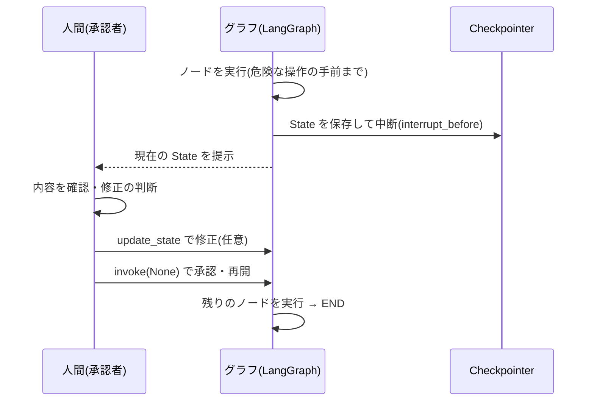

## このセクションで学ぶこと

- human-in-the-loop が「人間の承認・修正をフローに組み込む」設計であることを理解する
- interrupt で止め update_state で反映し invoke(None) で再開する一連の型を組み立てられる
- 承認待ち・人間による修正・差し戻しといった実務パターンの使いどころを判断できる

## human-in-the-loop とは

LLM を使ったフローを完全自動で走らせると、誤った内容のメールを送る、不要な課金を発生させる、間違ったデータを書き込む、といった事故が起きえます。そこで、**重要な判断や取り返しのつかない操作の手前に「人間の確認・承認・修正」のステップを意図的に挟む**設計が **human-in-the-loop(HITL)** です。

前のセクションで学んだ interrupt / get_state / update_state / invoke(None) は、まさにこの HITL を実現するための部品です。本セクションでは、それらを 1 つの実務的な型として組み立てます。基本の流れは「止める → 人間が見る → 必要なら直す → 続きを動かす」です。



## 具体例:メール送信を承認制にする

「下書きを作る → 送信する」というフローで、送信の前に必ず人間の承認を挟む例です。`send_email` の直前で止め、内容を確認してから再開します。

```python
app = graph.compile(
    checkpointer=checkpointer,
    interrupt_before=["send_email"],
)
config = {"configurable": {"thread_id": "mail-1"}}

# 1. 下書き生成まで進み、send_email の手前で停止
app.invoke({"topic": "請求書の督促"}, config)

# 2. 人間が下書きを確認(Web なら画面に表示する)
snapshot = app.get_state(config)
draft = snapshot.values["draft"]

# 3. 修正したい場合は State を上書き(任意)
app.update_state(config, {"draft": draft + "\n\nよろしくお願いいたします。"})

# 4. 承認 = 続きを実行。差し戻すならここで invoke しない
app.invoke(None, config)   # ここで初めて送信される
```

ここで「承認」は単に `invoke(None)` を呼ぶこと、「差し戻し(却下)」は再開を呼ばずに止めたままにすること、「修正」は再開前に `update_state` を挟むこと、と素直に対応します。3 つの操作がすべて同じ部品の組み合わせで表現できるのが LangGraph の HITL の利点です。

## 注意点

中断中の State は checkpointer に保存されたまま残るため、人間がいつ戻ってきても thread_id さえ分かれば再開できます。一方で、承認されないまま放置されたチェックポイントが溜まっていくので、**承認待ちの有効期限や打ち切り(タイムアウト)**を運用側で決めておく必要があります。

また、Web アプリでは「中断 → 画面表示」と「承認ボタン → invoke(None)」がそれぞれ別のリクエストになります。両者は同じ thread_id を共有しなければ別の会話として扱われてしまうため、thread_id をセッションやタスクに正しく紐づけて受け渡すことが HITL を成立させる前提になります。承認の主体が誰か(本人か上長か)といった権限の検証も、グラフの外側のアプリ層で必ず行ってください。

## まとめ

- human-in-the-loop は、重要な操作の手前に人間の確認・承認・修正を挟む設計で、事故を防ぐ。
- interrupt で止め、get_state で見せ、必要なら update_state で直し、invoke(None) で再開する型で実現する。
- 承認待ちの放置対策(タイムアウト)と、リクエストをまたぐ thread_id の受け渡し・権限検証はアプリ側の責任。
