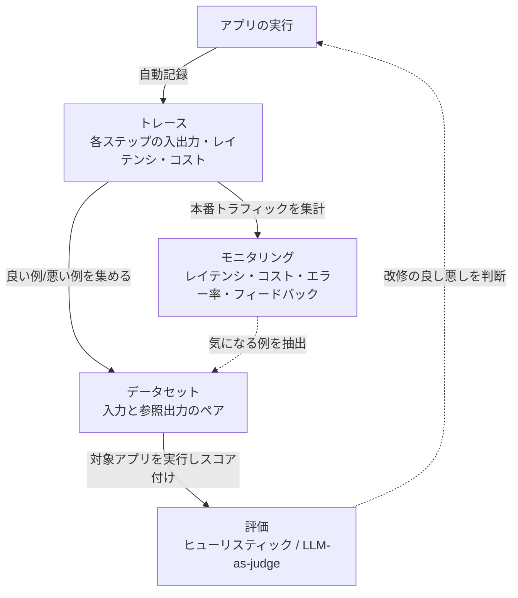

## このセクションで学ぶこと

- LangSmith の主要機能(トレース / データセット / 評価 / モニタリング)を区別できる
- 各機能が開発から運用までのどの局面で効くかを理解する
- 機能どうしが一つのデータ基盤の上でどうつながっているかを俯瞰できる

## 4 つの主要機能と、その関係

LangSmith は多機能ですが、入り口を押さえれば全体像はシンプルです。中心には**トレース**という共通のデータがあり、そこから**データセット**・**評価**・**モニタリング**が枝分かれしていく、と捉えてください。

## それぞれの機能が効く局面

**トレース**はすべての起点です。アプリを実行すると、各ステップ(LLM 呼び出し・検索・ツール実行など)が親子の階層で自動記録されます。開発中のデバッグでも本番運用でも、最初に開いて確認するのはこのトレースです。ここに正確なデータが残っているからこそ、後続の評価やモニタリングが成り立ちます。第 2 章で詳しく扱います。

**データセット**は、入力と(あれば)期待する参照出力をペアにして集めたものです。トレースの中から「うまくいった例」「失敗した例」を拾ってデータセットに追加できるため、観測したデータがそのまま品質改善の素材になります。

**評価**は、データセット上でアプリを実行し、評価器でスコアを付けて品質を数値で測る仕組みです。評価器には文字列一致のような単純な**ヒューリスティック**と、別の LLM に出力の良し悪しを判定させる **LLM-as-judge** があります。第 3 章のテーマです。

**モニタリング**は、本番のトラフィックを継続的に集計し、レイテンシ・コスト・エラー率・ユーザーフィードバックといった指標をダッシュボードで監視する機能です。開発時の評価が「リリース前の品質チェック」だとすれば、モニタリングは「リリース後に劣化や異常を早期に気づくための見張り役」にあたります。第 5 章で扱います。

この章では各機能の使い方そのものには踏み込みません。まずは「どの機能が、開発から運用までのどの局面で効くのか」という地図を頭に入れることが目的です。地図があれば、次章以降で個別機能を学ぶときに、それが全体のどこに位置づくのかを見失わずに済みます。

## ひとつのデータ基盤の上で循環する

重要なのは、これらが**バラバラのツールではなく、トレースという共通基盤の上でつながっている**ことです。本番モニタリングで見つけた問題のあるトレースをデータセットに加え、評価で改修の効果を確かめ、改善をデプロイする——という改善ループが一つのプラットフォームで完結します。個別機能を覚える前に、この循環の絵を頭に入れておくと、以降の章が一本の線でつながります。

## まとめ

- LangSmith の中心はトレースで、そこからデータセット・評価・モニタリングが派生する
- トレースは開発・運用の両方で最初に見るデータ
- 4 機能は共通基盤の上で改善ループを形づくる
