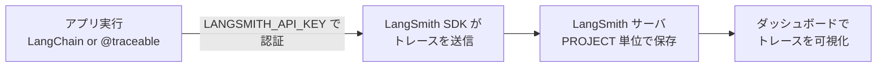

## このセクションで学ぶこと

- API キーとプロジェクトを準備し環境変数を設定できる
- 環境変数だけで既存の LangChain アプリのトレースを有効化できる
- LangChain を使わないコードでも `@traceable` でトレースを送れることを知る

## 必要なものは API キーと環境変数だけ

LangSmith を使い始めるのに必要なのは、(1) アカウントを作って **API キー**を発行すること、(2) いくつかの**環境変数**を設定すること、の 2 つだけです。LangChain を既に使っているアプリなら、コードを 1 行も書き換えずにトレースを有効化できます。

まず LangSmith の管理画面でアカウントを作り、Settings から API キー(`lsv2_...` の形式)を発行します。次に、アプリのプロセスに次の環境変数を渡します。

```bash
export LANGSMITH_TRACING=true
export LANGSMITH_API_KEY="lsv2_xxxxxxxxxxxxxxxx"
export LANGSMITH_PROJECT="my-first-app"   # 省略時は default プロジェクト
```

`LANGSMITH_PROJECT` は**プロジェクト**名で、トレースをまとめる入れ物です。アプリごと、あるいは開発・本番の環境ごとに分けておくと後で整理しやすくなります。SDK をまだ入れていなければ次でインストールします。

```bash
pip install -U langsmith langchain
```

## 既存の LangChain アプリはこれだけで動く

環境変数を設定したら、LangChain のコードは**そのまま**実行するだけです。チェーンやエージェントの各ステップが自動的にトレースとして LangSmith に送信されます。

```python
from langchain_openai import ChatOpenAI

# LANGSMITH_TRACING=true が効いていれば、この呼び出しは自動でトレースされる
llm = ChatOpenAI(model="gpt-4o-mini")
result = llm.invoke("LangSmith を一言で説明して")
print(result.content)
```

実行後、LangSmith の管理画面で `LANGSMITH_PROJECT` に指定したプロジェクトを開くと、いま実行したトレースが現れます。

## LangChain を使わないコードでも記録できる

LangChain を経由しない素の関数でも、`@traceable` デコレータを付ければトレースを送れます。OpenAI SDK を直接叩くような実装でも観測性を確保できます。

```python
from langsmith import traceable

@traceable
def answer(question: str) -> str:
    # 任意の処理。この関数の実行が 1 つの Run として記録される
    return call_my_model(question)
```

## アプリからダッシュボードまでの流れ

設定後、トレースがどう流れて可視化されるかを図で押さえておきます。



## まとめ

- 必要なのは API キーの発行と環境変数の設定だけ
- 既存の LangChain アプリは `LANGSMITH_TRACING=true` でコード変更なしにトレースされる
- LangChain を使わない関数も `@traceable` で記録でき、プロジェクト単位で可視化される
