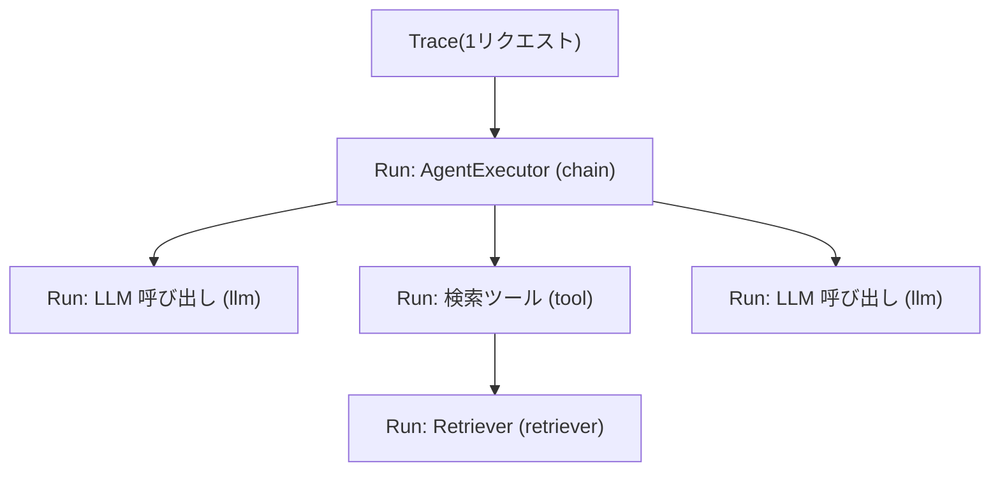

## このセクションで学ぶこと

- Trace と Run の違いと、Run が親子関係で入れ子になる仕組みを理解する
- 1 つの Run が持つ入出力・レイテンシ・トークン・ステータスを読み取れる
- LangSmith の UI で Run ツリーをたどって全体像を把握できる

## TraceとRunの関係

LangSmith でデバッグを始める前に、まず記録の構造を押さえておきましょう。LangSmith では実行ログを **Trace** と **Run** という 2 つの単位で扱います。

**Trace** は「1 回のリクエスト」に対応する記録のまとまりです。たとえばユーザーが 1 つの質問を投げ、アプリがそれに答えるまでの一連の処理が 1 つの Trace になります。

**Run** はその Trace の中で起きた個々の処理です。チェーンの実行、LLM の呼び出し、ツールの実行、リトリーバの検索などが、それぞれ 1 つの Run として記録されます。Run には種類を表す `run_type`(`chain` / `llm` / `tool` / `retriever` など)が付き、UI 上でアイコンや集計に使われます。

重要なのは、**Run は親子関係を持って入れ子になる**という点です。たとえば「エージェントの Run」の下に「LLM 呼び出しの Run」と「ツール実行の Run」がぶら下がる、という木構造(Run ツリー)になります。Trace 全体は、このツリーの一番上にある **ルート Run** から始まります。

## 1つのRunから読み取れる情報

個々の Run をクリックすると、デバッグに必要な情報がまとめて表示されます。実務でまず確認するのは次の項目です。

- **入力 / 出力(Input / Output)**: その Run に渡された値と返した値。LLM Run ならプロンプトと生成テキスト、ツール Run なら引数と戻り値が見えます。
- **レイテンシ(Latency)**: その Run の処理にかかった時間。親 Run の時間は子 Run の合計を含むため、どこで時間を食っているかをツリーでたどれます。
- **トークン数(Tokens)**: LLM Run の入力・出力トークン数。コスト試算やプロンプト肥大の発見に使います。
- **ステータス(Status)**: 成功か失敗か。エラーが出た Run は赤く表示され、エラーメッセージも確認できます。

たとえば「回答は返ってきたが妙に遅い」ときは、ルート Run のレイテンシを見て、次に子 Run を展開して、どの LLM 呼び出しやツール実行が時間を占めているかを特定します。「途中で落ちた」ときは、赤くなっている Run を探してその入出力とエラーを読みます。

## 注意点

Run ツリーは入れ子の親 Run のレイテンシに**子の待ち時間が含まれる**点に注意してください。親が 8 秒でも、その内訳が「LLM 5 秒 + ツール 2 秒」のように分かれていることがあります。親の数字だけ見て判断せず、必ずツリーを展開して内訳を確認します。また、入出力が大きい Run(長いコンテキストなど)は UI 上で省略表示されることがあるため、全文を見たいときは展開操作が必要です。

## まとめ

- Trace は 1 リクエスト分の記録、Run はその中の個々の処理単位で、親子の木構造になる。
- 各 Run からは入出力・レイテンシ・トークン・ステータスが読め、デバッグの起点になる。
- 親 Run のレイテンシは子を含むので、必ずツリーを展開して内訳を確認する。
