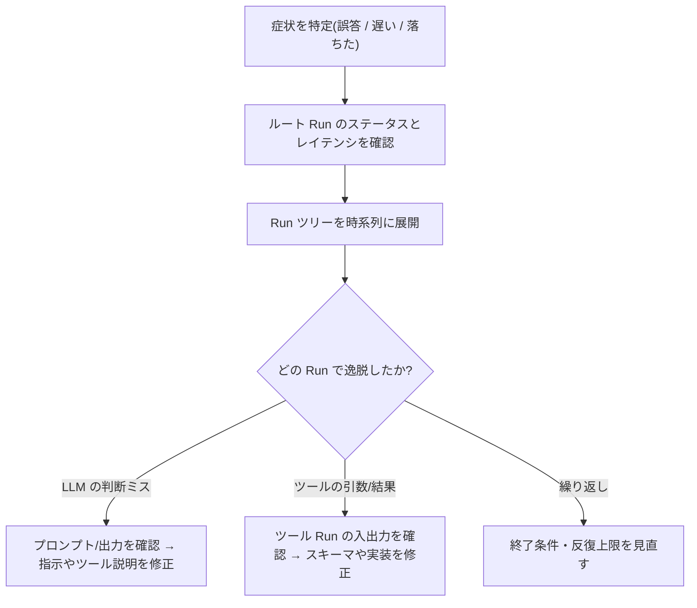

## このセクションで学ぶこと

- エージェント特有の失敗パターン(ループ・誤ったツール選択・引数ミス)をトレースから見分ける
- 中間ステップ(思考・ツール呼び出し・観測)を Run ツリーでたどって原因を切り分ける
- 仮説 → 該当 Run の確認 → 修正という体系的なデバッグの流れを身につける

## エージェントはなぜデバッグしにくいのか

単純なチェーンと違い、エージェントは「次に何をするか」を LLM 自身が決めます。そのため出力だけを見ても、なぜその答えになったのか、どこで間違えたのかが分かりません。前のセクションで見た Run ツリーは、まさにこの「途中で何が起きたか」を可視化するためのものです。

エージェントの Trace を開くと、ルートの `AgentExecutor` の下に、**中間ステップ**が時系列で並びます。典型的には「LLM が次の行動を決める Run」→「ツールを呼ぶ Run」→「その結果を受けてまた LLM が考える Run」という連鎖です。この連鎖をたどることが、エージェントのデバッグそのものです。

## よくある失敗パターンとトレース上の現れ方

実務でつまずくパターンは、トレース上で次のように見えます。

- **誤ったツール選択**: 検索すべき場面で計算ツールを呼んでいる、など。LLM Run の出力(どのツールを選んだか)と、その直前のプロンプトを照合します。
- **引数ミス**: 正しいツールを選んでいるのに、ツール Run の入力(引数)が空・型違い・想定外の文字列になっている。ツール Run の Input を開いて確認します。
- **ループ**: 同じツール呼び出しが何度も連続し、終了条件に到達できない。Run ツリーに同種の Run がずらりと並ぶので一目で分かります。
- **観測の取りこぼし**: ツールの戻り値(Output)は正しいのに、次の LLM Run のプロンプトにそれが反映されていない。受け渡しの不備です。

## デバッグの進め方

行き当たりばったりに眺めるのではなく、次の流れで切り分けると速く原因に到達できます。

たとえば「答えが的外れ」なら、まず最後の LLM Run の入力プロンプトを開き、そこに渡っているコンテキスト(ツールの観測結果)が妥当かを見ます。コンテキストが空なら原因はツール側、コンテキストは正しいのに回答が悪いなら原因はプロンプトや指示側、と切り分けられます。

## 注意点

エージェントの Trace は Run の数が多くなりがちなので、いきなり全部読もうとせず「最初に逸脱した Run」を探すのがコツです。途中の 1 ステップが間違えると以降は連鎖的に崩れるため、**一番上流のおかしな Run** を直すのが最短です。また、再現性のないバグは入力やランダム性(temperature)が絡むことが多いので、同じ入力の Trace を複数比較すると傾向がつかめます。

## まとめ

- エージェントのデバッグは Run ツリーで中間ステップをたどることに尽きる。
- 失敗は「ツール選択ミス・引数ミス・ループ・観測の取りこぼし」として現れる。
- 「最初に逸脱した Run」を上流から特定し、LLM 側かツール側かを切り分けて直す。
