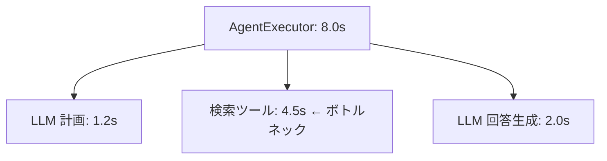

## このセクションで学ぶこと

- エラーになった Run をフィルタで絞り込み、根本原因の Run を特定する手順を理解する
- 親子 Run のレイテンシ内訳を読み、時間を食っている処理を切り分ける
- 直列・並列・リトライがレイテンシに与える影響を踏まえて改善方針を立てる

## エラーの根本原因を特定する

前のセクションまでで Run ツリーの読み方と絞り込みを身につけました。ここではそれを「速度と安定性の改善」につなげます。まずエラーから見ていきましょう。

LangSmith ではステータスが失敗の Run は赤く表示され、`error` でフィルタすると失敗したトレースだけを一覧できます。ここで大事なのは、**赤い Run が複数あっても原因は最上流の 1 つ**であることが多い、という点です。途中の LLM 呼び出しが落ちると、それを呼んだ親 Run も連鎖的に失敗扱いになるためです。

そこでエラー調査では、ツリーの一番奥(末端)で最初に失敗している Run を探し、その入力とエラーメッセージを読みます。よくあるのは、ツール Run での外部 API のタイムアウトや 4xx、LLM Run でのコンテキスト長超過やレート制限です。エラーメッセージはそのまま原因を語っていることが多いので、まず全文を確認します。

さらに有効なのが、前のセクションで付けたメタデータやタグとの組み合わせです。たとえば `tags` に `prod` を含み、かつステータスが error の Run だけを抽出すれば、本番で実際に起きた失敗だけを母集団にできます。そこから `metadata.user_id` で特定ユーザーに絞れば、報告のあった事象をそのままトレースで再現確認できます。エラーは件数だけでなく「どの入力で起きるか」の偏りを見ると、再現条件や対象範囲が早くつかめます。

## レイテンシのボトルネックを切り分ける

遅さの調査は「どの Run が時間を食っているか」を内訳で見ることに尽きます。ルート Run のレイテンシは子の合計を含むので、親の数字だけでは判断できません。ツリーを展開し、各 Run の所要時間を比べて、突出している処理(ボトルネック)を特定します。

この例ではルートの 8 秒のうち検索ツールが 4.5 秒を占めており、ここが**クリティカルパス**です。LLM をいくら速くしても全体は縮まないので、改善はまず検索側に向けます。

## 注意点

レイテンシを読むときは実行形態に注意します。**直列**なら各 Run の時間が足し算で効きますが、**並列**実行では一番遅い枝だけが全体時間を決め、他の枝の時間は隠れます。並列なのに合計が合わないと感じたら、それが正常です。

もう一つの落とし穴が**リトライ**です。失敗して再試行し最終的に成功した Run は、見た目は成功でもレイテンシが倍増していることがあります。「たまに妙に遅い」トレースは、内訳にリトライが潜んでいないかを疑ってください。改善は、まずボトルネック Run を 1 つ特定し、そこだけに手を入れて再計測する、という小さなループで進めるのが確実です。

## まとめ

- エラーは末端で最初に失敗した Run を起点に、入力とエラーメッセージから根本原因を特定する。
- レイテンシはツリーを展開して内訳を比べ、突出した Run(ボトルネック)を見つける。
- 直列・並列・リトライで時間の効き方が変わるため、実行形態を踏まえて改善対象を選ぶ。
