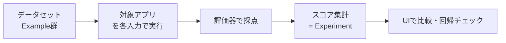

## このセクションで学ぶこと

- データセット・対象アプリ・評価器を組み合わせて評価を実行する流れを理解する
- evaluate() で結果を集計し UI でスコアを確認できる
- 改修前後の Experiment を比較して品質の回帰をチェックできる

## 評価パイプラインの全体像

ここまでで用意したデータセット(03-02)と評価器(03-03)を組み合わせると、オフライン評価が実行できます。流れはシンプルで、データセットの各 Example の入力を対象アプリに与えて出力を得て、その出力を評価器で採点し、全件のスコアを集計します。この一連の実行結果のまとまりを Experiment(実験)と呼びます。



## evaluate() で実行する

SDK の `evaluate()` は、対象アプリ・データセット・評価器の 3 つを受け取り、上の流れを自動で回します。対象アプリは「inputs を受け取って outputs を返す関数」として渡します。

```python
from langsmith import Client, evaluate

client = Client()

def app(inputs: dict) -> dict:
    # 実際のチェーンやエージェントを呼ぶ
    summary = summarize_chain.invoke(inputs["text"])
    return {"summary": summary}

results = evaluate(
    app,
    data="support-summaries",          # データセット名
    evaluators=[exact_match, llm_judge],  # ともに 03-03 で用意した評価器
    experiment_prefix="baseline",      # 実験名の接頭辞
)
```

実行が終わると、LangSmith の UI に Experiment が 1 件できます。Example ごとの入力・出力・各評価器のスコアが表になり、平均スコアや分布も確認できます。個々の行をクリックすれば、その 1 件のトレース(第 2 章の Run ツリー)まで辿れるので、低スコアの原因を具体的に調べられます。

## 改修前後を比較して回帰をチェックする

評価の真価は比較にあります。プロンプトやモデルを変えたら、同じデータセットで再度 `evaluate()` を実行し、新しい Experiment を作ります。`experiment_prefix` を `"v2"` のように変えておくと区別しやすくなります。UI ではデータセットに紐づく複数の Experiment を並べ、Example 単位でスコアの差分を確認できます。

ここで重要なのが回帰チェックです。「全体の平均スコアは上がったが、特定のエッジケースだけ大きく下がっている」というデグレはよくあります。平均だけを見ず、スコアが下がった Example を個別に確認する習慣をつけてください。改修のたびにこの比較を回すことで、勘ではなく数字で改善を判断できます。

## 注意点

評価器に LLM-as-judge を含めるとコストとレイテンシがかかるため、データセットが大きいときは件数や並列度に注意します。また、対象アプリ側に非決定性(temperature が高いなど)があるとスコアが揺れるので、比較目的の評価では設定を固定すると差分が読みやすくなります。

## まとめ

- evaluate() はデータセット・対象アプリ・評価器をまとめて実行し Experiment を作ります。
- UI では Example ごとのスコアとトレースを確認でき、低スコアの原因まで辿れます。
- 改修前後の Experiment を比較し、平均だけでなく個別のデグレを見て回帰チェックします。
