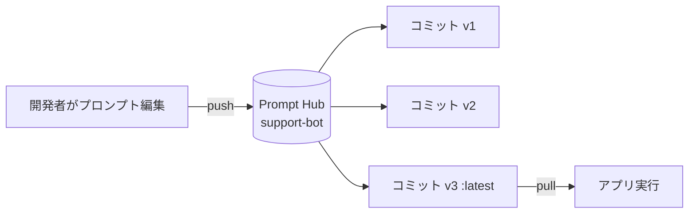

## このセクションで学ぶこと

- プロンプトをコードから切り離して管理する利点を理解する
- Prompt Hub でプロンプトをプッシュ・プル・バージョン管理する流れをつかむ
- コミット(バージョン)とタグでプロンプトの変更履歴を追えるようにする

## プロンプトをコードに埋め込む限界

LLM アプリの品質は、モデルそのものと同じくらい「どんなプロンプトを渡すか」に左右されます。ところが多くのプロジェクトでは、プロンプトの文字列がソースコードの中に直接書き込まれています。これには次のような不便がつきまといます。

- プロンプトを 1 文字直すだけでもコードのデプロイが必要になる
- 「いつ・誰が・なぜ」プロンプトを変えたのかが履歴として残らない
- 非エンジニア(プロンプト設計を担う人)が手を出しにくい
- 改善前のプロンプトに即座に戻せない

**Prompt Hub** は、こうした「プロンプトをコードから切り離して資産として管理する」ための仕組みです。プロンプトを LangSmith 側のレジストリに保存し、Git のようにバージョンを刻みながら、アプリからは名前で呼び出します。

## プッシュ・プル・バージョン管理の流れ

基本操作は「プッシュ(保存)」と「プル(取得)」の 2 つです。プロンプトを保存するたびに、内容のハッシュを持つ**コミット(バージョン)**が自動で発行されます。

```python
from langsmith import Client
from langchain_core.prompts import ChatPromptTemplate

client = Client()

# プロンプトを定義して Prompt Hub にプッシュ(保存)する
prompt = ChatPromptTemplate.from_messages([
    ("system", "あなたは丁寧なカスタマーサポートです。"),
    ("human", "{question}"),
])
client.push_prompt("support-bot", object=prompt)

# アプリ側では名前で取得(プル)して使う
loaded = client.pull_prompt("support-bot")
```

同じ名前で再度プッシュすると、内容が変わっていれば新しいコミットが積まれます。`support-bot:abc123` のようにコミットハッシュを付けて、過去の特定バージョンを名指しで取得することもできます。



## タグで環境を切り替える

コミットハッシュは正確ですが人間には読みにくいため、**タグ**を使って意味のある別名を付けます。たとえば検証済みのバージョンに `prod`、試験中のものに `dev` を付けておけば、アプリは `support-bot:prod` を取得するだけで、安定版だけを本番で使えます。プロンプトを改善したら新コミットを `dev` で試し、問題なければ `prod` タグを付け替える、という運用ができます。

## 注意点

- プッシュしたプロンプトはワークスペース内で共有されるため、機密情報(APIキーや個人情報を含む例文)を埋め込まないようにします。
- 内容が前回と完全に同じ場合は新しいコミットは作られません。意図せずバージョンが増えない・減らないことを履歴で確認しましょう。
- アプリでハッシュやタグを指定せず名前だけでプルすると、常に最新コミットが取得されます。本番では `prod` のようなタグ固定を推奨します。

## まとめ

- Prompt Hub はプロンプトをコードから切り離し、Git のようにバージョン管理・共有する仕組みです。
- push / pull で保存・取得し、保存ごとにコミット(バージョン)が自動発行されます。
- タグ(`prod` / `dev` 等)で環境を区別し、本番ではタグ固定で安定版を使うと安全です。
