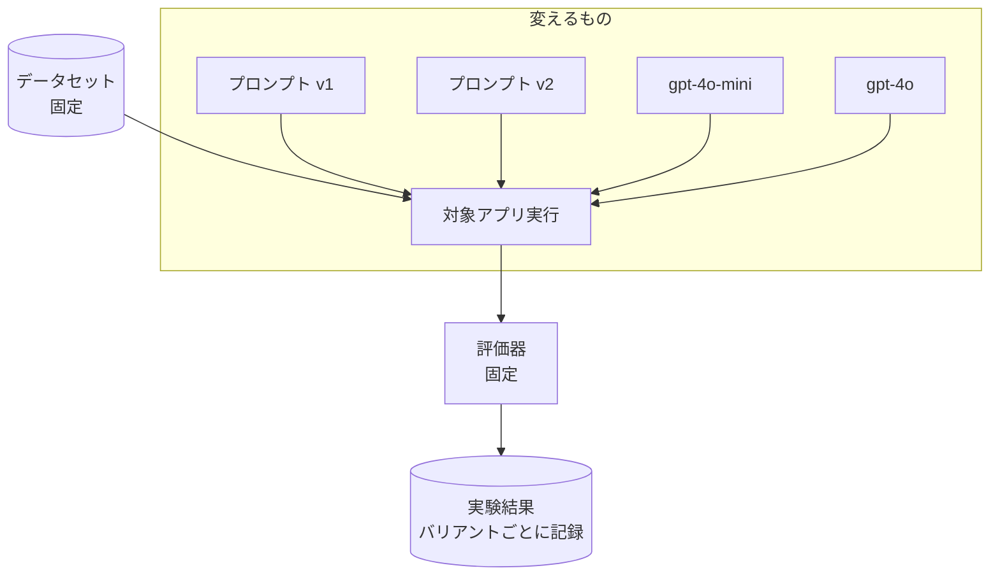

## このセクションで学ぶこと

- 実験(experiment)とは何を固定し何を変えるものかを理解する
- 同じデータセット上でプロンプト・モデル・パラメータを差し替えて比較する方法を学ぶ
- 複数バリアントを並行して評価し、結果を 1 か所に集約する流れをつかむ

## 実験とは「固定」と「変更」を切り分けること

プロンプトを改善するとき、勘で書き換えて「なんとなく良くなった気がする」で終わらせては再現性がありません。LangSmith の**実験(experiment)**は、評価を再現可能な形にする仕組みです。

実験の考え方はシンプルで、**「測る基準は固定し、試したい条件だけを変える」**ことに尽きます。

- **固定するもの**: データセット(入力と参照出力のペア)と評価器
- **変えるもの**: プロンプトのバージョン、モデル、temperature などのパラメータ

変えた条件の組み合わせ一つひとつを**バリアント**と呼びます。前章で作ったデータセットと評価器(03 章)をそのまま土台にできるので、評価のものさしは共通のまま、設定だけを差し替えて比べられます。



## プロンプトとモデルを差し替えて実行する

`evaluate` にデータセットと評価器を渡し、対象アプリ側だけを差し替えると、それぞれが別の実験として記録されます。

```python
from langsmith import evaluate, Client
from langchain.chat_models import init_chat_model

client = Client()

def make_target(prompt_name, model_name):
    prompt = client.pull_prompt(prompt_name)
    model = init_chat_model(model_name, temperature=0)
    chain = prompt | model
    return lambda inputs: {"answer": chain.invoke(inputs).content}

# バリアント1: プロンプト v1 × gpt-4o-mini
evaluate(
    make_target("support-bot:v1", "openai:gpt-4o-mini"),
    data="support-eval-set",
    evaluators=[correctness],
    experiment_prefix="v1-mini",
)

# バリアント2: プロンプト v2 × gpt-4o
evaluate(
    make_target("support-bot:v2", "openai:gpt-4o"),
    data="support-eval-set",
    evaluators=[correctness],
    experiment_prefix="v2-4o",
)
```

`experiment_prefix` に分かりやすい名前を付けておくと、後で結果一覧から目的のバリアントを見つけやすくなります。各実行はデータセットに紐づいて保存され、同じデータセットの実験どうしを並べて比較できる状態になります。

## 注意点

- 一度に複数の条件を同時に変えると、改善の要因がプロンプトなのかモデルなのか切り分けられません。**変える条件は一度に一つ**が比較の鉄則です。
- temperature が高いと同じ設定でも出力がばらつきます。比較目的の実験では temperature を 0 など低めに固定すると、差が設定由来かノイズかを見分けやすくなります。
- 評価器を途中で変えるとスコアの基準が変わってしまい、過去の実験と比較できなくなります。

## まとめ

- 実験はデータセットと評価器を固定し、プロンプト・モデル・パラメータだけを変えて比較する仕組みです。
- `evaluate` に対象アプリを差し替えて渡すと、バリアントごとに別の実験として記録されます。
- 変える条件は一度に一つに絞り、temperature を固定すると差を正しく読み取れます。
