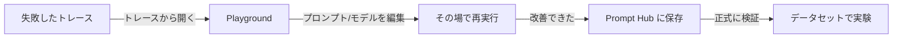

## このセクションで学ぶこと

- Playground でプロンプトとモデルをブラウザ上から即座に試せることを理解する
- 失敗したトレースを Playground で開いて、その場で修正・再実行する流れをつかむ
- Playground での手早い検証と、データセット上の正式な実験との役割分担を区別する

## Playground はブラウザ上の試し打ち場

ここまでのセクションでは、`evaluate` を使ってデータセット上で実験を回し、結果を比較してきました。ただ、改善のたびにコードを書いて実行するのは、ちょっとした言い回しを変えたいだけのときには重く感じます。**Playground**は、その「ちょっと試したい」を埋めるための画面です。

Playground では、ブラウザ上でプロンプト本文・モデル・temperature などのパラメータを直接編集し、入力を与えて**その場で実行**できます。ローカルに環境を用意したりスクリプトを書いたりする必要はありません。出力を見て表現を直し、もう一度実行する、というサイクルを数秒単位で回せるのが最大の利点です。Prompt Hub(04-01)に保存済みのプロンプトを読み込んで編集の出発点にすることもできます。

## トレースから開いてその場で直す

Playground が実務で効くのは、**失敗したトレースをそのまま開ける**点です。第 2 章で見たように、トレースには各 Run の入力・プロンプト・出力が記録されています。期待外れの出力を出した Run を見つけたら、それを Playground に**トレースから開く**ことで、その入力とプロンプトを起点に編集を始められます。

「この入力でなぜ崩れたのか」を再現された状態から検証できるので、原因の切り分けが速くなります。修正版で良い出力が得られたら、Prompt Hub に新しいバージョンとして保存し、次のステップへ渡します。

## 注意点

- Playground は**少数の手入力で感触をつかむ**ためのもので、ここで「良くなった気がする」だけで終わらせてはいけません。再現性のある判断には、データセット上の実験(04-02)と比較ビュー(04-03)が必要です。
- Playground での実行も API コストが発生します。手早く回せるぶん、高価なモデルで連打するとコストが積み上がる点に注意してください。
- temperature が高いと同じ入力でも出力が毎回変わります。表現の良し悪しを見極めたいときは temperature を低めにすると判断がぶれにくくなります。

## まとめ

- Playground はブラウザ上でプロンプト・モデルを即編集・即実行できる試し打ち場です。
- 失敗したトレースをそのまま開き、原因を再現しながらその場で修正・再実行できます。
- 手早い検証は Playground、再現性のある判断はデータセット上の実験、と役割を分けて使います。
