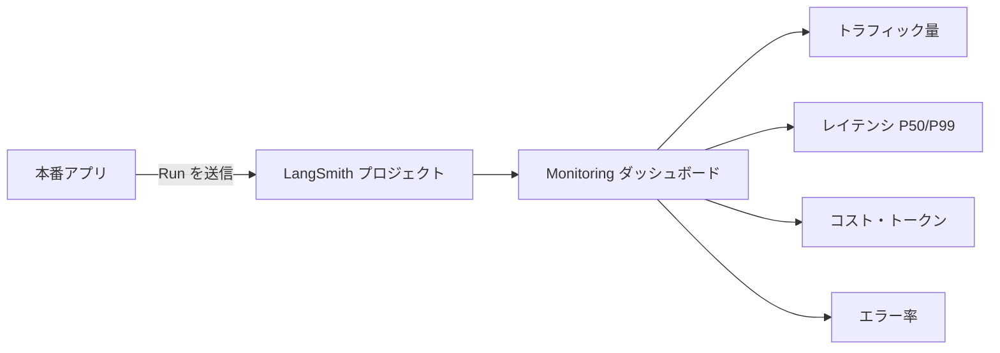

## このセクションで学ぶこと

- 本番運用で見るべき主要指標(レイテンシ・コスト・エラー率・トラフィック量)を理解する
- LangSmith の Monitoring ダッシュボードで時系列の変化を読み取れるようになる
- 開発時のトレースと本番モニタリングの目的の違いを把握する

## 開発時のトレースと本番モニタリングの違い

これまでの章では、1 本のトレースを開いて Run の親子関係や入出力を読み解く「個別のデバッグ」を扱ってきました。本番運用ではこの視点だけでは足りません。アプリには毎分・毎時間と大量のリクエストが流れ込むため、**1 本ずつ追うのではなく、トラフィック全体の傾向を時系列で眺める**必要があります。これが **モニタリング** です。

開発時のトレースが「この実行はなぜ失敗したのか」というミクロの問いに答えるのに対し、モニタリングは「今日は昨日よりレイテンシが悪化していないか」「コストが急増していないか」というマクロの問いに答えます。LangSmith ではプロジェクト単位の **Monitoring ダッシュボード** がこの役割を担い、トレースとして送られてきた Run を集計してグラフ化してくれます。

## 主要な監視指標

ダッシュボードで最初に確認すべき指標は次の 4 つです。

- **トラフィック量(Run 数)**: 単位時間あたりの実行回数。急増は負荷、急減は障害や経路断のサインです。
- **レイテンシ**: 応答時間。平均だけでなく **P50 / P99** で分布を見ます。平均は問題なくても P99 が跳ねていれば、一部のユーザーが極端に待たされています。
- **コスト / トークン消費**: モデル呼び出しのトークン数と推定コスト。プロンプト変更やリトライ増加で静かに膨らむことがあります。
- **エラー率**: エラーで終了した Run の割合。スパイクは外部 API の障害やプロンプト破綻を疑います。

## 具体例:朝のヘルスチェック

たとえば毎朝チームでダッシュボードを開く運用を考えます。トラフィック量がいつもどおりで、P99 レイテンシも平常値、エラー率が 1% 未満なら「正常」と判断して次の作業へ移れます。逆に P99 だけが前日の 2 倍に跳ねていれば、特定のモデルや経路が遅くなっている可能性が高く、第 2 章で学んだトレースのレイテンシ分析へドリルダウンします。コストが急に増えていれば、リトライ多発や長文プロンプトの混入を疑います。

このように、ダッシュボードは **異常の入口**であり、原因の特定は個別トレースに降りて行うという二段構えが基本です。

## 注意点

指標は **絶対値より「いつもとの差」** で見ます。レイテンシの良し悪しはアプリによって異なるため、まず平常時のベースラインを把握しておくことが前提です。また、ダッシュボードに表示されるのは LangSmith に送信された Run だけなので、トレースの送信が止まっていると「エラーがゼロ」に見えてしまいます。トラフィック量が想定よりゼロに近いときは、まず計測そのものが生きているかを疑ってください。

## まとめ

- 本番では個別トレースではなく、トラフィック全体の傾向を時系列で見るモニタリングが必要になる。
- レイテンシ(P50/P99)・コスト・エラー率・トラフィック量を主要指標として監視する。
- ダッシュボードは異常検知の入口で、原因特定は個別トレースへドリルダウンして行う。
