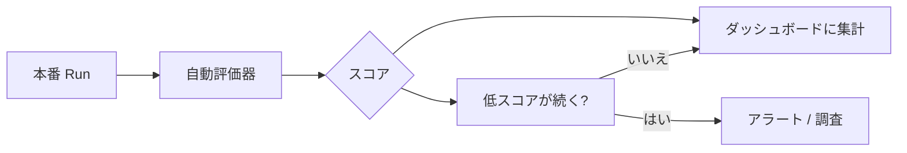

## このセクションで学ぶこと

- オフライン評価とオンライン評価の違いと役割分担を理解する
- 本番トラフィックに評価器を自動適用して品質をスコア化する仕組みを把握する
- スコアの劣化を検知してアラートにつなげる継続的監視の考え方を理解する

## オフライン評価とオンライン評価

第 3 章では、固定のデータセット上でアプリを実行して採点する **オフライン評価** を学びました。これはリリース前に「改修で品質が下がっていないか」を確かめる回帰チェックに向いています。しかし、本番には**データセットに無い未知の入力**が次々と来ます。事前に用意したテストだけでは、現実の劣化を見逃します。

そこで本番の実トラフィックに対して評価器を継続的に当てるのが **オンライン評価** です。ユーザーからの明示的フィードバックは一部しか得られませんが、オンライン評価なら **すべての Run に自動でスコア**を付けられます。両者は排他ではなく、オフラインでリリース前を守り、オンラインで運用中を守るという役割分担になります。

## 仕組み:本番 Run に評価器を自動適用する

オンライン評価では、第 3 章で学んだのと同じ種類の **自動評価器(evaluator)** を使います。違いは適用先で、データセットではなく **本番で発生した Run** に対してサンプリングしながら自動実行する点です。たとえば「回答が空でないか」「禁止語を含まないか」といった軽量なヒューリスティック評価器や、「回答が質問に答えているか」を採点する LLM-as-judge を、流れてくる Run に当ててスコアを残します。

スコアはフィードバックと同じ仕組みで Run に紐づくため、ダッシュボードで時系列に集計できます。これにより「正答率スコアが今週に入って徐々に下がっている」といった、エラーにはならないが品質が静かに劣化する変化を捉えられます。

## 具体例と注意点

たとえば検索を伴う QA ボットで、参照ドキュメントが更新された結果、回答の妥当性スコアがじわじわ下がったとします。エラー率やレイテンシは正常なので従来の監視では気づけませんが、オンライン評価のスコア低下がアラートを引き、調査のきっかけになります。

注意点は **コストとレイテンシ**です。LLM-as-judge を全 Run に当てると、評価のためのモデル呼び出しがアプリ本体の呼び出し回数とほぼ同数になり、評価コストが本体を上回ることもあります。そのため **サンプリング率を絞る**(例: 10% の Run だけ評価)のが定石です。サンプリングしても、傾向を見るには十分な量のスコアが集まります。また、オンライン評価は非同期に走らせ、ユーザーへの応答をブロックしないようにするのが基本です。評価器の出力もあくまで推定値なので、スコアの絶対値ではなく**トレンドの変化**を判断材料にします。

## まとめ

- オフライン評価はリリース前、オンライン評価は運用中の品質を守る役割分担になる。
- 本番 Run に自動評価器を当ててスコア化すると、未知入力に対する品質劣化を継続監視できる。
- 全件評価はコストが重いためサンプリングし、絶対値よりトレンドの変化で判断する。
