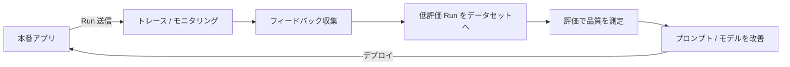

## このセクションで学ぶこと

- トレース・評価・モニタリングをつないだ運用サイクル(改善ループ)の全体像を理解する
- 本番の低評価 Run をデータセットに取り込み、回帰チェックに育てる流れを把握する
- 実務での運用例を通して LangSmith の各機能の役割分担を整理する

## 各機能は「改善ループ」としてつながる

これまでの章で、トレース(第 2 章)・評価(第 3 章)・プロンプト管理(第 4 章)・本番モニタリング(本章)を個別に学んできました。実務でこれらが真価を発揮するのは、**ひとつの運用サイクルとしてつながったとき**です。本番を観測し、ユーザーの反応を集め、品質を測り、改善を加えて、また観測する——この繰り返しが **改善ループ** です。

ループの起点はいつも本番です。モニタリングで異常やスコア低下を捉え(本章 1・3 節)、フィードバックで「どの回答が良くなかったか」を特定し(本章 2 節)、その失敗例を評価用のデータセットに加えます。改善後はそのデータセットで回帰チェックを行い、品質が戻った・上がったことを確認してからリリースします。手応えで直すのではなく、**測定に基づいて直す**のが要点です。

## 具体例:QA ボットを 1 サイクル改善する

社内向けの QA ボットを運用しているとします。ある週、オンライン評価の妥当性スコアがじわじわ下がり、モニタリングのアラートが点きました。フィードバックの 👎 を集めて中身を読むと、特定カテゴリの質問で参照ドキュメントを取り違えていると分かります。

そこで、低評価だった本番 Run を **そのままデータセットに取り込み**、正しい参照出力を付けてテストケースにします。次に第 4 章の手順でプロンプトを修正し、修正版と旧版をこのデータセット上で比較評価します。新しく追加したケースで妥当性スコアが改善し、既存ケースが劣化していないことを確認できたら、自信を持ってデプロイできます。デプロイ後は再びモニタリングで効果を観測し、次の劣化に備えます。

## 注意点

改善ループで一番効くのは、**本番の失敗例をデータセットに還流させる**仕組みです。これを習慣化しないと、データセットがいつまでも開発時の理想ケースだけになり、現実の弱点を捉えられません。一方で、低評価 Run を取り込む際は入力に含まれる個人情報のマスキングを忘れないでください。また、ループは一度回して終わりではなく、**定期的に回し続ける**ことで効果が出ます。週次でダッシュボードとフィードバックを棚卸しする、といった運用リズムを決めておくとよいでしょう。

## まとめ

- トレース・評価・モニタリングは、観測 → フィードバック → 評価 → 改善という改善ループとしてつながる。
- 本番の低評価 Run をデータセットに還流させると、回帰チェックが現実の弱点に強くなる。
- ループは測定に基づいて継続的に回し、デプロイ後も効果をモニタリングで確認する。
