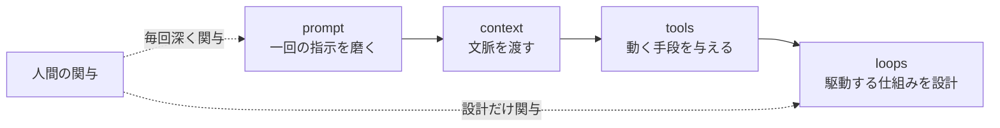

## このセクションで学ぶこと

- prompt → context → tools → loops という技術の進化の流れ
- 各段階で人間の関与位置がどう変わってきたか
- loops が harness engineering とも近い位置にあること

## 四段階の系譜

ループエンジニアリングは突然現れた発想ではなく、AI を使いこなす技術が積み上がってきた延長線上にあります。大きく四つの段階で整理できます。

1. **prompt(プロンプトを磨く)**: 一回の指示文を工夫して、良い回答を引き出す段階。
2. **context(文脈を設計する)**: 関連資料や過去のやり取りなど、判断に必要な材料を前もって AI に渡す段階。コンテキストエンジニアリングと呼ばれます。
3. **tools(ツールを与える)**: 検索やコード実行など、AI が自分で外部に働きかける手段を持たせる段階。AI が「読むだけ」から「動く」に変わります。
4. **loops(ループを設計する)**: 以上を組み込んだうえで、AI を繰り返し駆動する仕組みそのものを設計する段階。

下に進むほど、人間が手を動かす場所が「一回の指示」から「仕組み全体」へと外側に移っていくのが分かります。

## 人間の関与位置の変化

prompt の段階では、人間はやり取りのたびに深く関与します。context、tools と進むにつれて、人間が事前に整える割合が増え、その場の手数は減っていきます。そして loops では、人間は仕組みを一度設計するだけで、実行中のやり取りからはほぼ手を引きます。これが第 01-01 で見た「設計者に回る」という状態です。

別の見方をすると、各段階は「AI にできることを一段ずつ増やしてきた歴史」とも読めます。prompt は AI に正しく伝えられるようにし、context は判断材料を持たせ、tools は外の世界に手を伸ばせるようにしました。loops はその到達点として、AI が自分で次の一手を選びながら動き続けられるようにします。AI の自律性が上がった結果、人間が逐一面倒を見る必要が薄れ、設計に専念できるようになったわけです。

## harness engineering との近さ

loops は、エージェントを動かす土台(足回り)を整える harness engineering とも近い位置にあります。どちらも「個々の指示」ではなく「エージェントが動き続ける環境」を対象にしているからです。呼び方は文脈で揺れますが、この教材では、エージェントを繰り返し駆動する設計そのものをループエンジニアリングと呼びます。

## 注意点

四段階は「下が上を置き換える」関係ではありません。loops の内側では依然として prompt・context・tools が使われています。新しい段階は、前の段階を捨てるのではなく、その上に重ねる積層だと捉えてください。

## まとめ

- 技術は prompt → context → tools → loops と積み上がってきた。
- 段階が進むほど、人間の関与は「毎回の指示」から「仕組みの設計」へ外側に移る。
- loops は harness engineering と近く、前段階を置き換えるのではなく重ねるもの。
