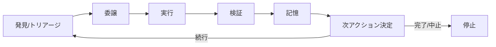

## このセクションで学ぶこと

- 1 回のループが「発見→委譲→実行→検証→記憶→決定」の 6 ステップで構成されることをつかむ
- ループはスケジュール上、またはゴール達成まで繰り返される回路だと理解する
- 各ステップが分業されているループほど壊れにくいことを直感する

## ループは 6 つのステップでできている

第 1 章では、ループエンジニアリングを「自分でプロンプトする代わりに、エージェントを駆動するループを設計すること」と定義しました。では、その「ループ」とは具体的に何でできているのでしょうか。この章では、ループを部品に分解して、その解剖図を描きます。

1 回のループは、おおむね次の 6 つのステップで構成されます。

1. **発見 / トリアージ** — 次にやるべき仕事を見つける
2. **委譲** — 見つけた仕事をサブエージェントに渡す
3. **実行** — 実際に手を動かして作業する
4. **検証** — 本当にできたのかを確かめる
5. **記憶(状態の永続化)** — 何が終わったか・残っているかを記録する
6. **次アクションの決定** — 続けるか、止めるか、別の仕事に移るかを決める

この 6 ステップが一巡したら、また 1 番に戻ります。ループは、スケジュール(たとえば「1 時間ごと」)に従って回るか、あるいは設定したゴールに到達するまで回り続けます。

## 具体例 — 「未対応の Issue を片付ける」ループ

たとえば「リポジトリの未対応 Issue を自動で片付けるループ」を考えてみます。**発見**で未対応の Issue 一覧を取得し、**トリアージ**で「まず直せそうなバグから」と選びます。選んだ仕事を**委譲**でサブエージェントに渡し、**実行**でコードを修正します。直したつもりで終わらせず、**検証**でテストを走らせて本当に直ったかを確かめます。結果を**記憶**に書き出し、最後に**決定**で「次の Issue へ進む」「今日はここまで」を判断します。

人間が毎回「次はこれをやって」と指示しないことに注目してください。次の仕事を探すところから、ループ自身がやっています。人間がやるのは、このループ全体をどう組むかを設計することだけです。

6 つのステップは、それぞれ実用上は別々の構成部品で支えられます。発見はスケジュール実行で、委譲はサブエージェントで、実行は git worktree や MCP で、検証は別の検証エージェントで、記憶は外部メモリで支えられます。いまはこれらの名前を覚える必要はありません。「ステップごとに専用の道具がある」という感覚だけ持っておけば十分です。これらの部品が具体的にどう組み合わさるかは、第 6 章でひとつの図にまとめて扱います。

## 注意点 — どのステップにいるかを常に意識する

これ以降のセクションでは各ステップを掘り下げますが、検証(maker-checker)・記憶・停止条件といった重いテーマは第 3〜5 章で改めて深掘りします。この章ではまず「そのテーマがループのどの位置にあるか」を地図として押さえてください。位置がわかっていれば、後の章の話が「ループのどこを強化する話なのか」として理解しやすくなります。

## まとめ

- ループは「発見→委譲→実行→検証→記憶→決定」の 6 ステップが繰り返される回路です。
- スケジュール、またはゴール達成まで回り続けます。
- まずは各ステップがループのどこにあるかという地図を持つことが、この章の目的です。
