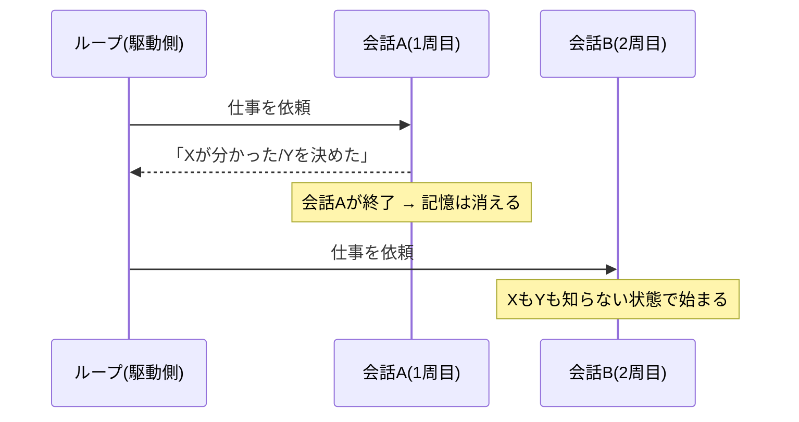

## このセクションで学ぶこと

- モデルは実行(会話)をまたいで記憶を持たないこと
- 会話が切れると「分かったこと」「決めたこと」が消える仕組み
- だから作業の状態を会話の外に置く必要がある、という結論

## モデルは会話の外を覚えていない

ループエンジニアリングで最初に押さえるべき事実があります。**モデルは実行(会話)をまたいで記憶を持たない**ということです。1 回の会話の中では、それまでのやり取りを文脈として参照できます。しかしその会話が終われば、あるいは別の会話として新しく立ち上がれば、前回そこで何を調べ、何を決めたかは、モデルの側には何も残っていません。

ここがループ設計でつまずきやすいところです。人間は前回の続きから自然に作業を再開できますが、モデルにはその「前回」がありません。毎回の周回は、極端に言えば**初対面の相手に仕事を頼み直している**ようなものなのです。

## 具体例 — 切れた瞬間に消えるもの

たとえばエージェントに「このリポジトリの失敗テストを直して」と頼んだとします。1 周目の会話の中で、エージェントは「原因は設定ファイルの読み込み順だ」と突き止め、「まず設定を読んでから初期化する方針で直す」と決めたとします。

ところがこの会話が一度切れて、次の周回が新しい会話として始まると、その「原因が読み込み順だと分かったこと」も「この方針で直すと決めたこと」も、モデルの中には残っていません。次の周回のモデルは、また同じ調査をゼロからやり直すか、前回とは別の方針を選んでしまいます。

つまり**消えるのは会話のログだけではなく、そこで得た理解と決定そのもの**です。ループは何周も回るものですから、この「消える」性質を放置すると、周回を重ねても作業が前に進みません。

人間の作業に置き換えると分かりやすいかもしれません。あなたが調査して「原因はこれだ」とノートに何も書かずに帰宅し、翌朝そのノートが白紙だったら、また同じ調査からやり直すしかありません。モデルにとっては、毎回の周回がこの「白紙の翌朝」なのです。違うのは、人間は経験として頭に残るのに対し、モデルは会話が切れた時点で本当に何も残らない、という点です。

ここで強調しておきたいのは、これがモデルの能力の問題ではないことです。どれだけ高性能なモデルでも、会話の外に置いた情報を勝手に思い出すことはできません。記憶を引き継ぐかどうかは、モデルの賢さではなく**ループを設計する側が状態をどう扱うか**で決まります。だからこそ、これはループエンジニアリングの最初の論点になります。

## 注意点

- これは不具合ではなく、モデルのそもそもの性質です。「気をつければ覚えてくれる」ものではありません。
- 「同じ会話を長く続ければよい」という対処は限界があります。会話はいずれ切れますし、長くなれば文脈も扱いづらくなります。状態を残す仕組みは別に用意する必要があります。
- 記憶を会話の外に置く具体的な方法は次のセクション(03-02)で扱います。ここでは「外に置かないと消える」という前提だけ持ち帰ってください。

## まとめ

- モデルは実行(会話)をまたいで記憶を持たず、会話が切れれば理解も決定も消える
- だから次の周回は「初対面に頼み直す」状態から始まってしまう
- 作業を前に進めるには、状態を会話の外に残す仕組みが要る(次セクションへ)
