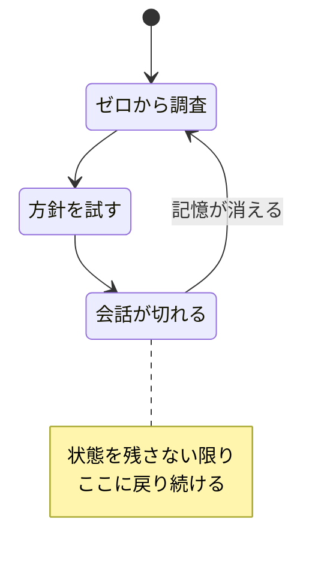

## このセクションで学ぶこと

- 状態を持たないループが陥る具体的な症状
- なぜ同じ仕事のやり直し・失敗の反復が起きるのか
- メモリがループ設計で最初の必須要素とされる理由

## 状態を残さないと何が起きるか

これまでのセクションを裏返すと、状態を残さないループの末路が見えてきます。モデルは毎回ゼロから始めるので、症状は決まって次の三つに収束します。

- **同じ仕事を何度もやり直す** — 前回の調査結果が残っていないので、毎周回また同じ調査からスタートします。
- **前回の失敗を繰り返す** — 失敗履歴がないので、すでに駄目と分かった方法にまた手を出します。
- **進捗が積み上がらない** — 完了の記録がないので、何周回しても「終わったこと」が増えていきません。

図のように、状態がないループは同じ場所をぐるぐる回ります。回数だけ増えて、ゴールには近づきません。

## 具体例 — 賽の河原のループ

失敗テストを直すループを、メモリなしで回したとします。1 周目で原因を「読み込み順」と突き止めますが、会話が切れて記憶が消えます。2 周目はまた一から調査し、今度は「設定をハードコードする」案を試しますが、これは実は前にも試して別テストを落とした失敗策でした。3 周目もまた調査から始まります。

外から見ると動いているように見えますが、**実際には何も積み上がっていません**。コストと時間だけが消えていきます。これが「毎回ゼロから問題」です。

たちが悪いのは、この症状が一見「ちゃんと働いている」ように見える点です。エージェントは毎周まじめに調査し、もっともらしい方針を立て、コードを書きます。ログを眺めれば活発に動いています。しかし周回をまたいだ視点で見ると、同じ円を描いているだけです。前のセクション(03-03)で見た「決定の根拠」と「失敗履歴」を残していれば、2 周目は読み込み順の修正に直行でき、3 周目はハードコード案を最初から候補から外せました。状態がないために、その積み上げがまるごと失われているのです。

## メモリが最初の必須要素である理由

ここまでくると、なぜメモリがループ設計で**最初の必須要素**とされるのかがはっきりします。状態がなければ、どれだけ賢いモデルを使っても、どれだけ周回を増やしても、ループは前に進みません。検証や停止条件といった他の工夫も、進捗が積み上がる土台があって初めて意味を持ちます。逆に言えば、メモリを一枚用意するだけで、ループは「ゼロから」を抜け出して前進を始められます。

## 注意点

- 「賢いモデルなら覚えてくれる」は誤りです。性質上、状態を外に残さない限り毎回ゼロからです。
- 症状が「たまに重複する」程度でも、根は同じです。早めにメモリを入れておくほど後が楽になります。

## まとめ

- 状態を残さないループは、同じ仕事のやり直し・失敗の反復・積み上がらない進捗に陥る
- 原因は単純で、モデルが毎回ゼロから始めるから
- だからメモリはループ設計で最初に用意すべき必須要素になる
