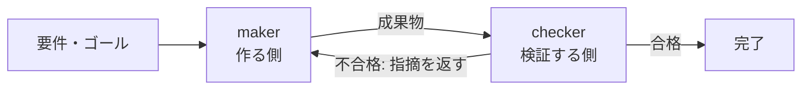

## このセクションで学ぶこと

- maker は作る役、checker は検証する役という役割分担
- 別エージェントとして配置し、checker の判定でループの周回を決めること
- Claude Code の /goal が maker と checker を分けている実例

## 2 つの役を別エージェントに分ける

前のセクションで「作る役と検証する役を切り離す」と述べました。これを実装に落とすと、シンプルに **2 つの役を別々のエージェントとして用意する** ことになります。

- **maker(作る側)**: 要件を受け取って成果物を作るエージェント。ループの「実行」を担います。
- **checker(検証する側)**: maker が作ったものを受け取って、要件を満たしているかを判定するエージェント。ループの「検証」を担います。

ループは、maker が成果物を作り、checker がそれを採点し、その判定をもとに「もう一周するか / 完了とするか」を決める、という形で回ります。

重要なのは、maker と checker が **別コンテキスト**(別エージェント・別会話)に置かれている点です。checker は maker がどう考えて作ったかを引きずらず、渡された成果物だけを見て判定します。これにより、前のセクションで見た「自分の宿題を甘く採点する」問題を構造的に避けられます。

## 実例: Claude Code の /goal

具体例として、Claude Code の `/goal` コマンドがあります。`/goal` は、検証可能な条件が満たされるまでエージェントを走らせ続け、その「完了したか」の採点を **別のモデル** に行わせます。

ここで起きているのは、まさに maker と checker の分離です。作業を進めるエージェント(maker)と、完了を判定するモデル(checker)が別になっているからこそ、「完了」という言葉が意味を持ちます。もし作業した本人が「完了です」と言うだけなら、その完了は前のセクションのとおり信用できません。判定者を分けて初めて、「完了」が独立した検査をくぐった状態を指すようになるのです。

## 注意点

maker と checker を分けるといっても、必ずしも別の AI モデルを使う必要はありません。同じモデルでも、別のエージェント・別の会話として起動すれば文脈は分かれます。肝心なのは「作った文脈をそのまま検証に持ち込まない」ことです。また、checker が不合格を返したときに maker へ指摘を戻して作り直させる往復が、ループの一周になります。この往復が回り続けることで、人手を介さずに品質が少しずつ上がっていきます。なぜ別コンテキストにすると効くのか、その理屈は次のセクションで掘り下げます。

## まとめ

- maker は作る役、checker は検証する役で、checker の判定がループの周回を決める。
- 両者を別コンテキストに置くことで「自分の宿題を採点する」問題を避けられる。
- Claude Code の /goal は別モデルが完了を採点する実例で、判定を分けるから「完了」が意味を持つ。
