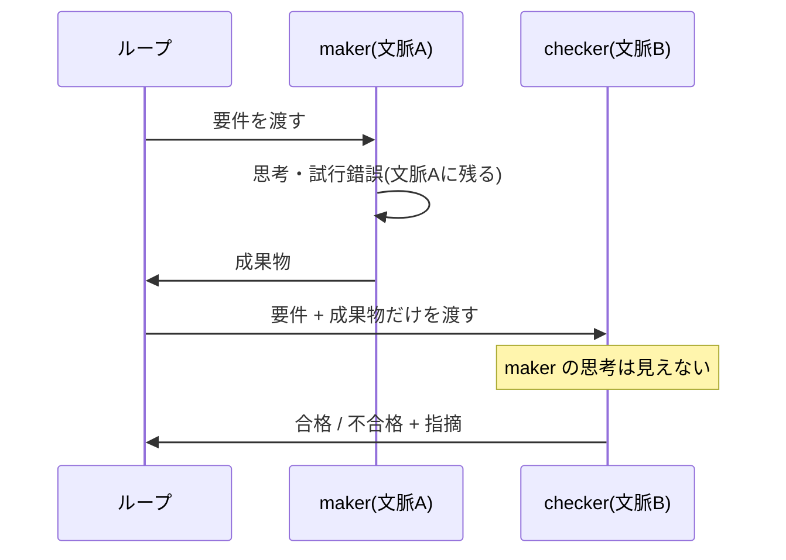

## このセクションで学ぶこと

- 同じコンテキストで検証すると maker の思考や言い訳に引きずられること
- checker を別文脈に置くと成果物だけを客観的に評価できること
- 「文脈の汚染」を避けることが検証の信頼性につながること

## 同じ文脈だと評価が引きずられる

maker と checker を分けるとき、なぜ「別コンテキスト」であることが重要なのでしょうか。鍵は、AI が直前までの会話の流れに強く影響される、という性質にあります。

同じ会話の中で「作って」から続けて「検証して」と頼むと、checker 役は maker 役が辿った思考をすべて見ている状態にあります。すると「さっき自分はこう考えたのだから、これで正しいはずだ」というバイアスがそのまま検証に入り込みます。途中で「テストはあとで書けばいい」と判断していたら、検証のときもその言い訳を引き継いでしまい、テストの欠落を見逃します。これが **文脈の汚染** です。作る過程の思考や言い訳が、検証の目を曇らせるのです。

しかも、この汚染は本人には気づきにくいという厄介さがあります。同じ文脈の中にいる checker は、自分が maker の思考に引きずられていることを自覚できません。むしろ「一貫した判断をしている」と感じてしまいます。だからこそ、意志の力で公平に採点しようとしても限界があり、構造として文脈を切り離すしかないのです。

## 成果物だけを見る目をつくる

これを避けるには、checker を maker とは **別のコンテキスト**(別エージェント・別会話)に置きます。別文脈の checker は、maker がどう悩み、どんな言い訳をしたかを知りません。手元にあるのは「要件」と「成果物」だけです。

人間の世界に置き換えると、提出物だけを見て採点する外部の試験官に近い立場です。試験官は受験者がどんな気持ちで解いたかを知らず、答案そのものだけを評価します。だからこそ判定が公平になります。checker を別文脈に置くのは、この「外部の試験官」を AI のループの中に作る、ということなのです。

## 注意点

別コンテキストにすると、checker は maker が持っていた背景情報も知らない状態になります。そのため、checker が正しく判定できるよう、要件や合格基準は成果物と一緒に明示的に渡す必要があります。「文脈を共有しない」ことと「必要な情報を渡さない」ことは別です。汚染になる思考の履歴は渡さず、判定に必要な基準だけは確実に渡す、と覚えてください。逆に言えば、合格基準があいまいなまま checker に投げると、別文脈にしても判定がぶれます。何をもって合格とするかをはっきりさせておくことが、別コンテキストの効き目を引き出す前提になります。

## まとめ

- 同じ文脈で検証すると、maker の思考や言い訳に引きずられて評価が甘くなる(文脈の汚染)。
- checker を別コンテキストに置くと、要件と成果物だけを見る「外部の試験官」になれる。
- ただし合格基準など判定に必要な情報は、別文脈の checker にも明示的に渡す。
