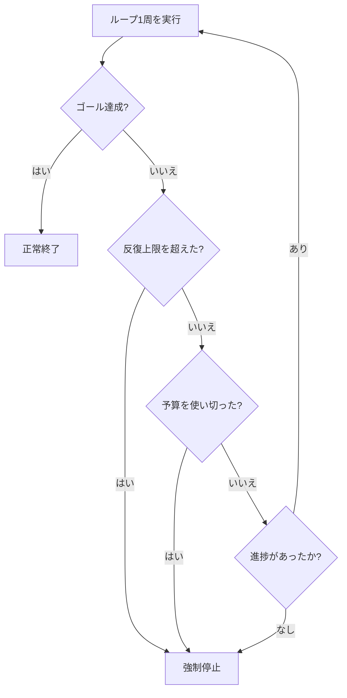

## このセクションで学ぶこと

- 本番のループは停止条件を1つに頼らず、複数を多層で重ねることを理解する
- 反復上限・コスト予算・進捗なし検出・ゴール達成チェックの4つの役割をつかむ
- 「停止条件がないループは寝ている間も課金され続ける」という失敗を回避する

## 停止条件は1つでは足りない

前のセクションで「ゴールに検証可能な終了条件を持たせる」話をしました。しかし、ゴール達成チェックだけに頼るのは危険です。ゴールにバグがあったり、エージェントが達成できないまま空回りしたりすると、ループは止まらなくなります。

そこで本番のループは、**複数の停止条件を多層で重ねます**。どれか1つでも引っかかったら止まる、という安全網を張るのです。代表的な4層を見ていきます。

1. **反復上限(max iteration limit)** — 「最大 20 周まで」のように回数の上限を切る。最後の砦。
2. **コスト予算(budget)** — 使ってよいトークン量や金額の上限を決め、超えそうなら止める。
3. **進捗なし検出(no-progress detection)** — 何周回っても状態が前に進まないなら止める。
4. **ゴール達成チェック(goal-achievement check)** — ゴールの終了条件が満たされたら、正常終了する。

## 具体例 — 4層が重なって暴走を止める

「テストを通す」ループで考えます。理想は **ゴール達成チェック**(テストが全部緑)で気持ちよく正常終了することです。しかし、もしテストがどうやっても通らない不具合に当たったら、ゴールチェックは永遠に成立しません。

このとき他の3層が効きます。エージェントが同じ修正を何度も試して状態が変わらなければ **進捗なし検出** が止めます。それもすり抜けても、トークンを使い切れば **コスト予算** が止めます。最終的には **反復上限** が「20 周やってダメなら強制終了」と打ち切ります。1層が破れても次の層が受け止める、という多層防御です。

## 注意点 — 停止条件のないループは「寝ている間に破産する」

最もありがちで、最も高くつく失敗が「停止条件を入れ忘れたループ」です。停止条件がないループは永遠に走り続け、あなたが寝ている間も API 課金を積み上げます(bill you in your sleep)。朝起きたら予算が溶けていた、という事故は現実に起こります。

だからこそ、ゴール達成チェックを書く前に、まず反復上限とコスト予算という「最低限の安全網」を先に入れる習慣をつけてください。順番が逆になると、安全網のないまま試運転してしまいます。

## まとめ

- 停止条件は1つに頼らず、反復上限・コスト予算・進捗なし検出・ゴール達成チェックを多層で重ねます。
- 1層が破れても次の層が受け止める多層防御で、暴走を止めます。
- 停止条件のないループは寝ている間も課金され続けるので、安全網を先に入れます。
