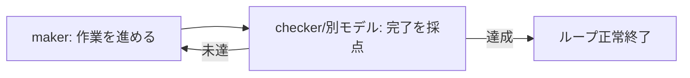

## このセクションで学ぶこと

- ゴール達成チェックが、検証可能な条件を満たすまでループを走らせる仕組みだと理解する
- 「完了」の採点を別モデルに任せる発想(maker-checker との接続)をつかむ
- 自分で自分に「できた」と言わせる採点が信頼できない理由を再確認する

## ゴール達成チェックは「完了」を決める仕事

多層の停止条件のうち、反復上限・予算・進捗なし検出は「暴走を止める安全網」でした。これに対してゴール達成チェックは、ループを**正常に終わらせる**ための判定です。検証可能な終了条件(05-01 で扱った「テストが全部緑」など)が満たされているかを毎周確かめ、満たされていればループを完了させます。

ここで問題になるのが、「誰がその合否を判定するのか」です。

## 別のモデルが「完了」を採点する

Boris Cherny が紹介したカスタムスラッシュコマンド `/goal`(Claude Code の標準機能ではなく、ユーザーが自作した一例)は、検証可能な条件が満たされるまでループを走らせ、**別のモデルが「完了」かどうかを採点する**仕組みを持っています。作業を進めた当人ではなく、別の主体が成果物を見て「ゴールを満たしている」と認めて初めて、ループは終わります。

これは第 4 章で扱った maker-checker パターンそのものの応用です。作る側(maker)と検証する側(checker)を分け、checker が「完了」を判定する。ゴール達成チェックは、この checker の仕事をループの停止条件として組み込んだものだと考えてください。checker が「まだ未達」と判定すれば、その指摘を手がかりに maker がもう1周作業を進めます。逆に「達成」と認めれば、そこでループは正常終了します。つまり「完了」という合図を出す権限を、作業した本人ではなく checker が握っているわけです。

## 注意点 — 自己採点は終了条件にしない

ゴール達成チェックで最もやってはいけないのが、作業した当人に「もう完了でいい?」と自己採点させることです。なぜそれが信頼できないかは第 4 章で詳しく扱ったので繰り返しませんが、要点だけ言えば、同じ文脈で作業した主体は自分の成果物に甘くなり、「だいたいできた」で完了を宣言してしまうからです。

ゴール達成チェックを意味あるものにするには、判定を別コンテキスト・別の主体に任せること。そうして初めて「完了」という停止条件が、ループを安心して止めてよい合図になります。

逆に言えば、ゴール達成チェックが甘いと、前のセクションで見た反復上限やコスト予算といった「暴走を止める安全網」ばかりが働くループになります。本来は気持ちよくゴール達成で終わるはずが、毎回上限や予算で打ち切られるのは、完了の判定が信頼できていないサインです。正常終了の質は、checker の厳しさで決まると覚えておいてください。

## まとめ

- ゴール達成チェックは、検証可能な条件が満たされたらループを正常終了させる判定です。
- `/goal` のように、完了の採点を別モデル(checker)に任せると信頼できます。
- 作業した当人の自己採点を終了条件にしてはいけません(第 4 章の maker-checker)。
