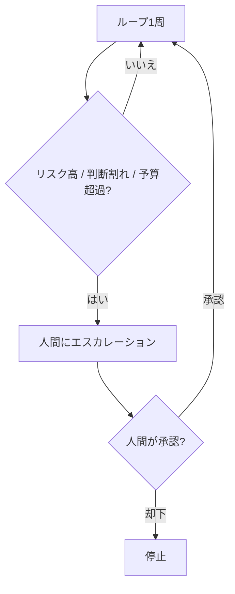

## このセクションで学ぶこと

- 完全自律ではなく、判断が割れる・リスクが高い局面で人間に戻す設計(Human-in-the-Loop)を理解する
- エスカレーションする条件を事前に決めておくべき理由をつかむ
- 停止条件とエスカレーションを組み合わせて、安全に止まるループを設計できる

## 完全自律がゴールではない

ここまで、ループを自律的に走らせ、安全に止める設計を見てきました。ですが「すべてを機械に任せきる」ことが目的ではありません。判断が割れる場面、間違うと取り返しがつかない場面では、ループは止まって**人間に判断を仰ぐ**べきです。これが Human-in-the-Loop(人間をループの中に置く)という考え方です。

停止条件が「無条件に終了する」のに対し、エスカレーションは「人間に引き渡して、その判断を待つ」点が違います。終わらせるのではなく、いったん人間にバトンを渡すのです。

## どこで人間に戻すかを事前に決める

エスカレーションの設計で大事なのは、**どの局面で人間に戻すかを事前に決めておく**ことです。代表的なトリガーは次のとおりです。

- **判断が割れる** — 進め方の選択肢が複数あり、エージェントが優劣を決めきれない。
- **リスクが高い** — 本番環境への適用、データ削除、外部への課金など、間違うと損害が大きい操作。
- **予算を超過しそう** — コスト予算(05-02)に近づき、続行の可否を人間に確認したい。

これらを事前に決めておかないと、エージェントは「とりあえず進める」を選びがちです。後から「なぜ勝手にやったのか」と気づいても遅いので、戻すポイントはループを動かす前に明文化しておきます。たとえば「データベースへの書き込みは承認必須」「1 回の実行で 5 ドルを超えたら確認」のように、具体的な条件として書き出しておくと、エージェントもあなたも迷いません。

## 注意点 — 戻しすぎても、戻さなさすぎてもいけない

エスカレーションは多すぎると、人間がボトルネックになり、ループの旨味(自律して進むこと)が消えます。逆に少なすぎると、危険な操作を無人で実行してしまいます。「テストを通す」程度の安全な作業は自律に任せ、本番反映や課金のような不可逆・高コストの操作だけ人間に戻す、というように粒度を見極めてください。

停止条件(暴走を止める)とエスカレーション(判断を人間に渡す)を組み合わせれば、ループは「勝手に走り続けない・危ない橋を独断で渡らない」という二重の安全を持てます。前者は時間とコストの暴走を防ぎ、後者は判断の暴走を防ぐ、と役割を分けて考えると整理しやすいでしょう。これがこの章のゴールです。

## まとめ

- 完全自律ではなく、判断が割れる・リスクが高い局面では人間に戻します(Human-in-the-Loop)。
- どこでエスカレーションするかは、ループを動かす前に明文化しておきます。
- 戻しすぎず戻さなさすぎず、不可逆・高コストな操作だけ人間に渡すのがコツです。
