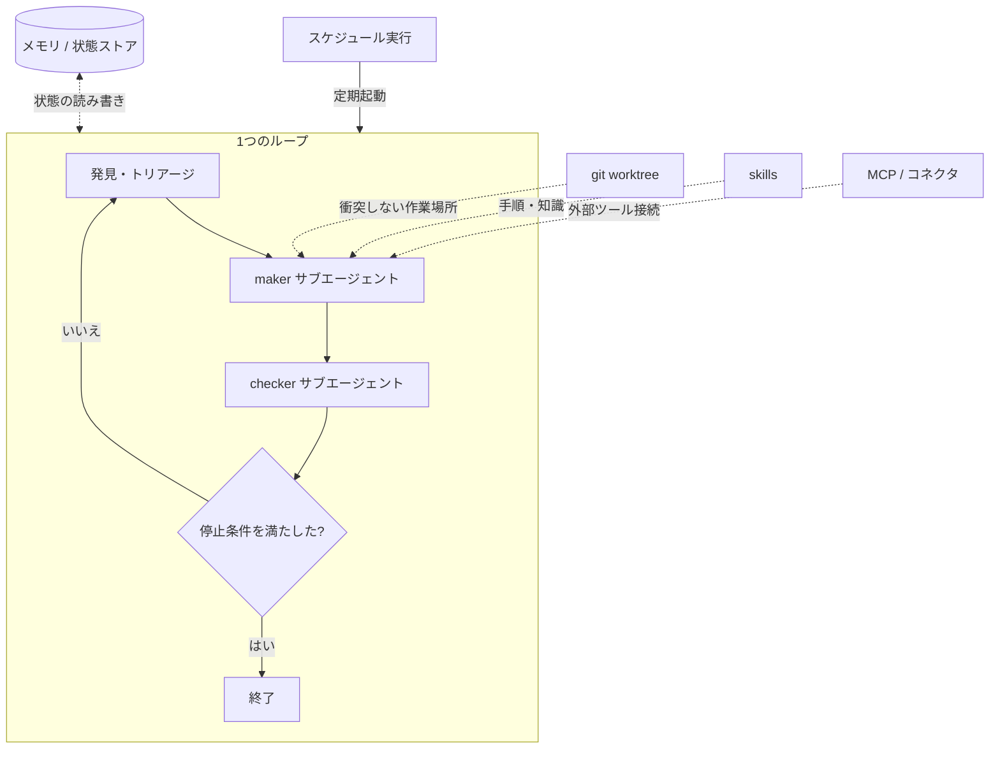

## このセクションで学ぶこと

- 実用的なループが5つの構成部品とメモリから組み上がることを理解する
- スケジュール実行・git worktree・skills・MCP・サブエージェントがそれぞれどの役割を担うかをつかむ
- 各部品が第02〜05章のどの仕事に対応するかを位置づける

## ループは「部品」で組み上がる

ここまで第02章でループの6ステップ(発見・委譲・実行・検証・記憶・決定)を解剖し、第03章で記憶、第04章で maker-checker、第05章で停止条件を見てきました。最終章では、それらを **実際に動くループへ組み立てる部品** を整理します。

実用的なループは、おおむね次の5つの構成部品と、土台となるメモリから成り立ちます。

1. **スケジュール実行** — 定期的にループを起動し、「発見・トリアージ」を回して次にやる仕事を見つける。
2. **git worktree** — 複数エージェントを並列で走らせても作業が衝突しないよう、作業ツリーを分ける。
3. **skills** — プロジェクト固有の知識や手順を蓄積し、エージェントに再利用させる。
4. **MCP / プラグイン(コネクタ)** — エージェントを実際のツール(API・DB・サービス)に接続する。
5. **サブエージェント** — maker と checker を別々のエージェントに分ける(第04章)。

これに加えて、**メモリ / 状態ストア** が会話の外で状態を永続化します(第03章)。

## 各部品が担う役割

部品は飾りではなく、**第02〜05章で見た仕事の担い手** です。スケジュール実行は「発見」の起点を自動化し、人間が毎回ループを手で叩かなくて済むようにします。git worktree は「実行」を並列化しても破綻させない土台です。skills はエージェントが毎回ゼロから手順を思い出さずに済むよう、手順を外から渡します。MCP は「実行」に必要な外部ツールへの口です。サブエージェントは「委譲」と「検証」を別人格に分けます。

つまり、6ステップという抽象を、これらの部品が具体的なインフラとして支えるわけです。

## 注意点 — 部品を全部そろえる必要はない

最初から5部品すべてを用意する必要はありません。小さなループなら、メモリ・サブエージェント・停止条件だけでも回ります。並列で大量の仕事を捌くようになって初めて worktree が要りますし、外部サービスを触らないなら MCP も不要です。**いま回したいループに必要な部品だけ** を選んでください。

ただし、次のセクションで見る3つの部品(メモリ・サブエージェント分離・停止条件)を欠くと、ループそのものが成立しません。これらは「あると便利」ではなく「ないと壊れる」核です。

## まとめ

- 実用的なループはスケジュール実行・worktree・skills・MCP・サブエージェントの5部品とメモリから組み上がります。
- 各部品は第02〜05章の6ステップ(発見・委譲・実行・検証・記憶・決定)を具体的に支える担い手です。
- 全部品をそろえる必要はなく、回したいループに必要なものだけ選びます。
