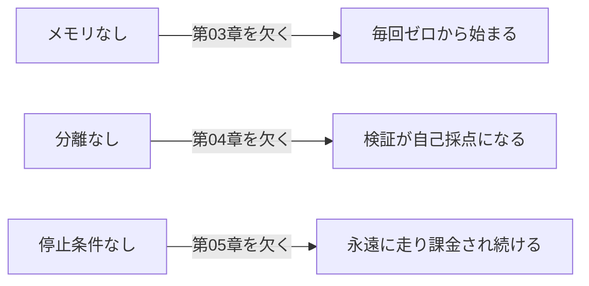

## このセクションで学ぶこと

- ビルダーがやりがちな3大失敗(メモリなし・分離なし・停止条件なし)を見分けられるようになる
- 各失敗が第03〜05章のどの設計を欠いた結果なのかを対応づける
- 3つの失敗を回避するための最小限のチェックを身につける

## 壊れるループには共通の型がある

ループ作りで失敗するパターンは、ばらばらに見えて実は3つに集約できます。いずれも、前章までで「ないと壊れる核」として扱った要素を欠いたときに起こります。

### ① メモリファイルがない

状態を会話の外に置かないと、ループは **毎回ゼロから始まります**(第03章)。前の周で何を終えたか、何が残っているかを覚えていないので、同じ仕事を何度もやり直したり、決定の根拠を忘れて迷走したりします。会話が切れれば状態も消える、という前提を忘れた結果です。

### ② サブエージェントの分離がない

maker と checker を分けないと、**1エージェントが作りも検証も自分でやろうとします**(第04章)。自分の宿題を自分で採点するようなもので、検証が自己採点になり「できました」が信用できなくなります。別コンテキストの checker がいないと、「完了」という言葉が意味を失います。

### ③ 停止条件がない

終了条件を入れ忘れると、ループは **永遠に走り続けます**(第05章)。ゴールを達成しても気づかず、達成できなくても止まらず、あなたが寝ている間も API 課金を積み上げます。反復上限やコスト予算という安全網を張り忘れた結果です。

## 具体例 — 「夜間に回したら朝には地獄」

ありがちなシナリオで考えます。「バグを直し続けて」というループを、メモリも checker も停止条件もなしで夜間に走らせたとします。エージェントは前回直した箇所を覚えていないので同じファイルを何度も触り(①)、自分で「直った」と判断して次へ進み(②)、ゴールにたどり着いたかどうかに関係なく回り続けます(③)。朝起きると、コミット履歴は混乱し、テストは緑とは限らず、請求額だけが膨らんでいます。3つの失敗は単独でも痛いですが、重なると被害が一気に拡大します。

## 注意点 — チェックは「3つ問うだけ」で足りる

複雑な検査は要りません。ループを回す前に、次の3つを自問してください。「状態はディスクにあるか?」「作る人と検証する人は別か?」「いつ止まるかが決まっているか?」。どれか1つでも No なら、回す前にそこを埋めます。この3問が、3大失敗を回避する最小限のゲートです。

注意したいのは、これらの失敗は **エージェントが賢くなっても消えない** という点です。モデルの性能が上がれば1周あたりの仕事の質は上がりますが、状態を覚える・自分を検証する・自分で止まる、という性質はモデル自体には備わっていません。賢いエージェントほど、停止条件のないループでは「もっと良くできる」と判断して延々と走り続けかねません。だからこそ、3つのゲートはモデルの賢さとは別に、ループの設計として必ず外側から用意する必要があります。

## まとめ

- 壊れるループは、メモリなし・分離なし・停止条件なしの3つに集約できます。
- それぞれ第03章・第04章・第05章の核を欠いた結果で、重なると被害が拡大します。
- 回す前に「状態はあるか・検証は別か・いつ止まるか」の3問でゲートをかけます。
