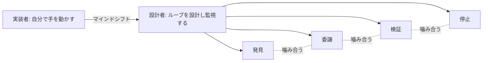

## このセクションで学ぶこと

- ループエンジニアが「実装者」から「システムの設計者・監視者」へ役割を移すことを理解する
- 磨くべきはプロンプトの言い回しではなく、発見・委譲・検証・停止が噛み合う仕組みであることをつかむ
- 本教材で学んだ要素を1つのマインドセットとして統合する

## 手を動かす人から、仕組みを設計する人へ

ここまで部品と失敗、そして最初のループの組み立てを見てきました。最後に、これらを束ねる発想の転換について話します。

ループエンジニアの仕事は、**自分で1つ1つの作業をこなすこと** ではありません。第01章で「もうプロンプトしない」という言葉から始めたように、一問一答でエージェントに指示を出し続ける限り、人間がボトルネックであり続けます。ループエンジニアは、**仕事をこなすループそのものを設計し、その健全性を監視する側** に回ります。実装者から設計者・監視者へのマインドシフトです。

## 磨くのは「魔法の言葉」ではなく「仕組み」

よくある誤解は、強力なプロンプトという「魔法の言葉(magic word)」を探し続けることです。しかしループエンジニアリングで磨くべきは、言い回しではありません。

- **発見** が「次にやるべき仕事」を正しく拾えているか(第02章)。
- **委譲** で maker に適切な単位の仕事が渡っているか(第02・04章)。
- **検証** が別コンテキストの checker で信頼できる形になっているか(第04章)。
- **停止** が多層で効いて、暴走も空回りも止められるか(第05章)。

これら4つが噛み合う仕組みを設計することが本質です。プロンプトの巧拙より、この歯車の組み合わせのほうがはるかに結果を左右します。

この発想の転換は、本教材を1本の線で振り返ると分かりやすくなります。第01章でループエンジニアリングを「自分でプロンプトする代わりに、エージェントを駆動するループを設計すること」と定義しました。第02章でループを6ステップに解剖し、第03章で記憶を会話の外へ、第04章で検証を別人格へ、第05章で停止を多層に置きました。本章でそれらを部品として組み上げ、3大失敗を避け、最初のループを書きました。これらは別々のテクニックではなく、「設計者として仕組みを組む」という1つのマインドセットの異なる側面です。

## 注意点 — 設計者でも「監視」は手放さない

設計者に回るとは、放任することではありません。ループは生き物のように調子を崩します。発見が的外れな仕事を拾い始めたり、checker が甘くなったり、停止条件が早すぎて未完で止まったりします。だからループエンジニアは、回したあとも **健全性を監視し、歯車を調整し続けます**。設計して終わりではなく、設計し、観察し、直す、という運用までが仕事です。逆に言えば、監視して直せるだけの「観測点」をループに埋め込んでおくことも設計の一部です。メモリに進捗を残し、停止理由をログに出しておけば、調子を崩したときにどの歯車が外れたかを後から追えます。

## まとめ

- ループエンジニアは実装者から、ループを設計し監視する設計者へと役割を移します。
- 磨くのはプロンプトの言い回しではなく、発見・委譲・検証・停止が噛み合う仕組みです。
- 設計して終わりではなく、ループの健全性を監視し調整し続けるところまでが仕事です。
