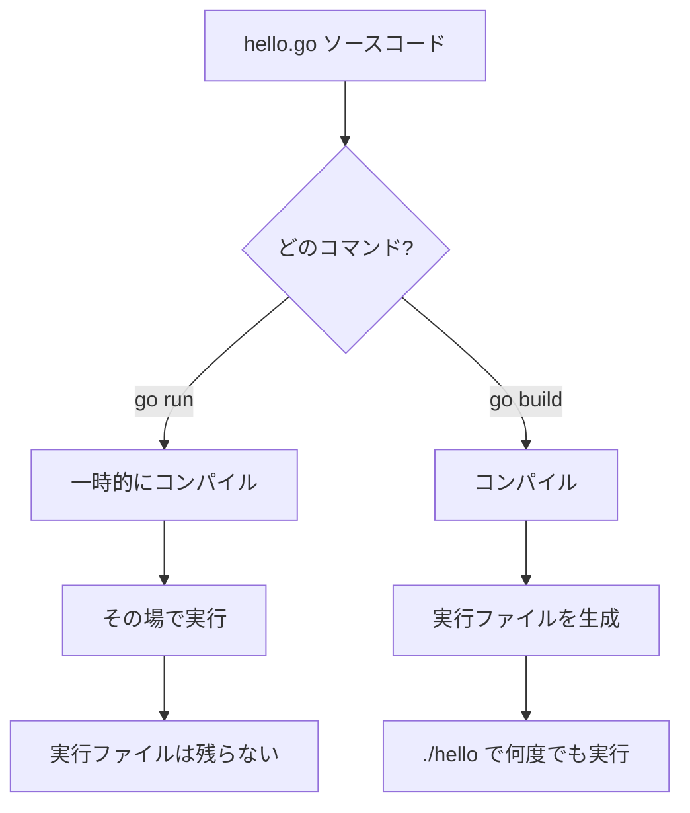

## このセクションで学ぶこと

- go run と go build の違いを説明できる
- ソースから実行ファイルが作られるまでの流れを理解する
- 簡単なプログラムの基本構成を把握する

## go run と go build の違い

前のセクションで使った `go run` は「すぐ動かして確認する」ためのコマンドでした。これに対して `go build` は「配布できる **実行ファイル** を作る」ためのコマンドです。両者の違いは、コンパイル結果を残すかどうかにあります。

`go run hello.go` を実行すると、Go は内部でいったんプログラムをコンパイルし、できた実行ファイルを一時的な場所で動かして、終わると捨てます。手元で動作を試すには便利ですが、ファイルは残りません。

一方 `go build hello.go` を実行すると、カレントフォルダに `hello`(Windows なら `hello.exe`)という実行ファイルが作られます。あとは `./hello` のように直接呼び出すだけで、Go がインストールされていない環境でも動かせます。

```bash
go build hello.go
./hello          # → Hello, World
```

## ソースから実行までの流れ

ソースコードが実行されるまでの流れを図にすると、次のようになります。



開発中は素早く試せる `go run`、完成して配布・運用する段階では `go build`、と使い分けるのが基本です。

## プログラムの基本構成

最後に、Go プログラムの基本構成をおさらいします。1 ファイルのプログラムは、おおむね次の順番で並びます。

1. **package 宣言**(`package main`): ファイルが属するパッケージ。
2. **import 宣言**(`import "fmt"`): 使う外部パッケージの取り込み。
3. **関数定義**(`func main()` など): 実際の処理本体。

この「パッケージ → import → 関数」という並びは、ファイルが増えても変わらない基本形です。注意点として、import したのに使わないパッケージや、宣言したのに使わない変数があると、Go はコンパイルエラーにします。これは余計なコードを残さないための仕様で、最初は戸惑いますが、コードを清潔に保つ助けになります。

## まとめ

- `go run` は即実行で結果を残さず、`go build` は実行ファイルを生成します。
- ソースはコンパイルを経て、OS が直接動かせる実行ファイルになります。
- 「package → import → 関数」が Go プログラムの基本構成です。
