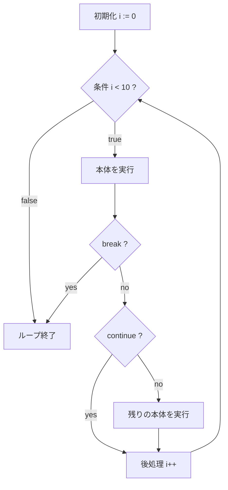

# for による繰り返し

## このセクションで学ぶこと

- Go の唯一の繰り返し構文 for の 3 つの書き方
- range を使ったスライスやマップの走査
- break / continue による繰り返しの制御

## Go の繰り返しは for だけ

多くの言語には `while` や `do-while`、`foreach` など複数の繰り返し構文がありますが、Go の繰り返しは **`for` 1 つだけ** です。覚える構文が 1 つで済むのは Go のシンプルさを表す好例で、書き方を変えるだけで他言語の `while` 相当も無限ループも表現できます。

もっとも基本的なのは、`初期化; 条件; 後処理` の 3 つを並べる形です。`if` と同じく、条件に丸括弧は付けず、波括弧は省略できません。

```go
for i := 0; i < 3; i++ {
    fmt.Println(i) // 0, 1, 2 と出力される
}
```

`i := 0` で開始し、`i < 3` を満たす間だけ本体を実行し、毎回 `i++` でカウントを進めます。この 3 要素は省略でき、条件だけを残すと他言語の `while` と同じ意味になります。

```go
n := 1
for n < 100 {     // while (n < 100) と同じ
    n = n * 2
}
```

3 要素をすべて省くと **無限ループ** になります。サーバの待ち受けや、条件が整うまで回し続けたい処理で使い、`break` で抜けます。

```go
for {
    // 何らかの処理。break するまで永遠に回る
}
```

## range で要素を順に取り出す

スライス(複数の値を並べたもの)やマップを先頭から順に処理するときは、`range` を使うのが定石です。`range` は **添字(インデックス)と値の 2 つ** を返します。

```go
fruits := []string{"apple", "banana", "cherry"}
for i, name := range fruits {
    fmt.Println(i, name) // 0 apple / 1 banana / 2 cherry
}
```

添字が不要なら、`_`(アンダースコア)で受け取って捨てます。前のセクションで触れた「使わない変数はエラー」を回避するための慣用句です。

```go
for _, name := range fruits {
    fmt.Println(name)
}
```

`range` は文字列やマップにも使え、書き方を統一できます。マップを回すと、キーと値が順に取り出せます(ただし取り出す順序は保証されません)。

## break と continue で流れを変える

繰り返しの途中で止めたり、特定の回をスキップしたりするには `break` と `continue` を使います。`break` はループそのものを抜け、`continue` はその回だけ飛ばして次へ進みます。

```go
for i := 0; i < 10; i++ {
    if i == 5 {
        break // 5 になったらループを終了
    }
    if i%2 == 0 {
        continue // 偶数はスキップして次へ
    }
    fmt.Println(i) // 1, 3 だけが出力される
}
```

この制御フローを図にすると、毎回の繰り返しで「条件判定 → 本体(分岐含む)→ 後処理」を巡回し、条件が偽になるか `break` で抜ける流れが見えてきます。



## 注意点

`continue` は **後処理(`i++` など)をスキップしない** 点に注意してください。図の通り `continue` の後も後処理は実行されるため、カウンタは進みます。これを取り違えると、後処理を自前で書いた無限ループで `continue` した瞬間にカウンタが進まず、永久に回り続けるバグになります。

もう 1 つ、`range` で受け取る値は **要素のコピー** です。ループ内で `name` を書き換えても元のスライスには反映されません。元の要素を変更したいときは `fruits[i]` のように添字で直接アクセスします。

## まとめ

- Go の繰り返しは `for` 1 つだけで、3 要素の省略で while や無限ループも表現できる。
- `range` はスライスやマップを「添字と値」で順に走査でき、不要な値は `_` で捨てる。
- `break` でループを抜け、`continue` で次の回へ進む(後処理はスキップされない)。
