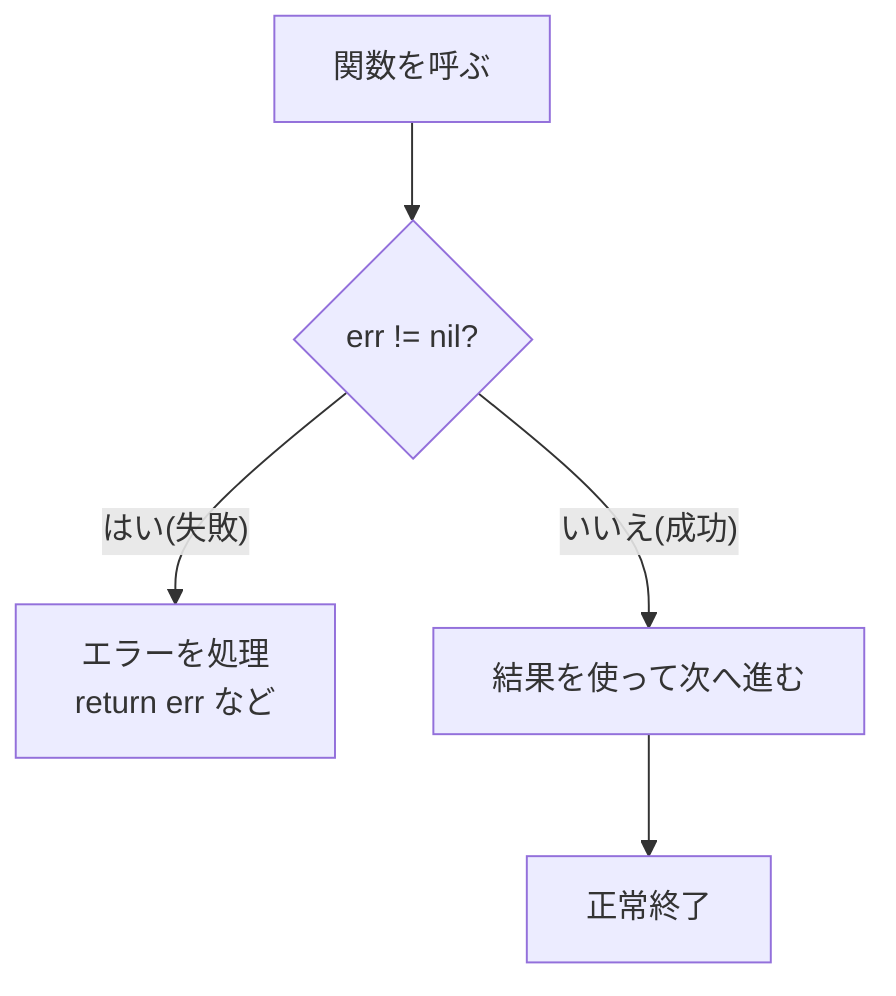

## このセクションで学ぶこと

- Go は例外ではなく `error` 値を返してエラーを伝えることを理解する
- `if err != nil` で失敗を早めに処理するパターンを書ける
- `errors.New` や `fmt.Errorf` で自分のエラーを作れる

## Go のエラーは「戻り値」

多くの言語では `try / catch` のような例外機構でエラーを扱いますが、Go は違います。Go では関数が **エラーを戻り値として返す** のが基本です。前のセクションで学んだ複数戻り値を使い、「結果」と「`error`」をペアで返します。

`error` は組み込みのインタフェースで、問題がなければ `nil`、何か起きたときはエラーを表す値が入ります。慣習として `error` は戻り値の最後に置きます。

```go
import "strconv"

n, err := strconv.Atoi("123")
if err != nil {
    // 変換に失敗したときの処理
    return err
}
// ここに来た時点で n は安全に使える
fmt.Println(n + 1)
```

## 値を返す経路とエラーを返す経路

エラーを返す関数を呼ぶたびに `if err != nil` で確認し、失敗していればその場で抜ける——これが Go のもっとも基本的な制御の流れです。成功した経路だけが下に進み、失敗は早めに切り離されるため、処理の本筋が読みやすくなります。



この「早めに返す(early return)」スタイルにより、ネストが深くならず、成功時の処理が一直線に並びます。例外のように離れた場所へジャンプしないので、どこで何が起きるかが追いやすいのも利点です。

## 自分でエラーを作る

自作の関数からエラーを返したいときは、`errors.New` か `fmt.Errorf` を使います。固定の文言なら `errors.New`、値を埋め込みたいなら `fmt.Errorf` が便利です。

```go
import (
    "errors"
    "fmt"
)

func divide(a, b int) (int, error) {
    if b == 0 {
        return 0, errors.New("ゼロで割れません")
    }
    return a / b, nil
}

func openAge(age int) error {
    if age < 0 {
        return fmt.Errorf("年齢が不正です: %d", age)
    }
    return nil
}
```

`fmt.Errorf` の書式指定子 `%w` を使うと、受け取った別のエラーを **包んで(ラップして)** 返せます。こうするとエラーの発生源をたどれる連鎖が作れ、呼び出し元で `errors.Is` などを使って元の種類を判定できます。

## 注意点

- 失敗するかもしれない関数のエラーを無視しないのが鉄則です。`_` で握りつぶすと、問題に気づけずバグの温床になります。
- エラーメッセージは小文字で始め、末尾に句点を付けないのが Go の慣習です(`fmt.Errorf("cannot open file")` のように)。
- `panic` は本当に回復不能な事態のためのもので、通常のエラー処理に使ってはいけません。期待される失敗は必ず `error` で表します。

## まとめ

- Go は例外ではなく `error` を戻り値で返してエラーを伝える。
- 呼んだ直後に `if err != nil` で確認し、失敗なら早めに返すのが定番。
- `errors.New` / `fmt.Errorf` で自作エラーを作り、`%w` で元のエラーを包める。
