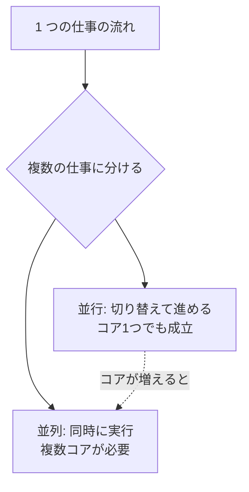

## このセクションで学ぶこと

- 並行(concurrency)と並列(parallelism)の違いを説明できる
- Go が並行処理を言語機能として備えている理由を理解する
- goroutine が軽量な実行単位であることを把握する

## 並行と並列はよく混同される

プログラムを書いていると、「複数の仕事を同時にこなしたい」という場面が必ず出てきます。たとえば Web サーバーが複数のリクエストを同時に処理する、あるいはファイルをダウンロードしながら画面を更新する、といったケースです。ここで登場するのが「並行(concurrency)」と「並列(parallelism)」という二つの言葉です。

**並行**は、複数の処理を「同時に進行しているように見せる」設計の考え方です。実際には CPU が処理を細かく切り替えているだけかもしれませんが、利用者から見れば複数の仕事が同時に進んでいるように扱えます。一方の**並列**は、複数の処理を本当に同じ瞬間に実行することで、複数の CPU コアが物理的に必要です。

つまり並行は「構造の話(どう設計するか)」、並列は「実行の話(実際にどう動くか)」だと整理できます。Go の作者である Rob Pike の有名な言葉を借りれば、「並行は並列ではない」のです。並行に書かれたプログラムは、コアが 1 つなら時分割で動き、コアが複数あれば自然と並列に動きます。

## goroutine ― Go の軽量な実行単位

多くの言語では、並行処理を OS のスレッドで実現します。しかし OS スレッドは 1 本あたり数 MB のメモリを使い、生成や切り替えのコストも小さくありません。そのため数千・数万のスレッドを起動するのは現実的ではありませんでした。

Go はこの問題を **goroutine** という独自の仕組みで解決しています。goroutine は Go ランタイムが管理する軽量な実行単位で、初期スタックは数 KB ほどしかなく、必要に応じて伸縮します。そのため数万・数十万の goroutine を起動しても問題なく動きます。Go ランタイムは少数の OS スレッドの上で、大量の goroutine を効率よく切り替えながら実行します。

関数呼び出しの前に `go` キーワードを付けるだけで、その関数は新しい goroutine として並行に実行されます。文法がこれほど単純なのは、Go が並行処理を「ライブラリ」ではなく「言語機能」として組み込んでいるからです。具体的な書き方は次のセクションで扱います。

## 注意点 ― 「軽い」けれど無制限ではない

goroutine が軽量だからといって、何も考えずに大量に起動してよいわけではありません。各 goroutine はメモリを消費しますし、共有データに同時にアクセスすればデータ競合(data race)が起きます。また、起動した goroutine を待たずに `main` 関数が終わるとプログラム全体が終了し、goroutine の処理が完了しないこともあります。これらの「同期」や「終了待ち」の話は、この章の後半で順に学んでいきます。

## まとめ

- 並行は「同時に進めるように設計する考え方」、並列は「実際に同時に実行すること」で別物。
- goroutine は OS スレッドより軽量な Go の実行単位で、大量に起動できる。
- 軽量でもデータ競合や終了待ちには注意が必要で、章の後半で対処法を学ぶ。
