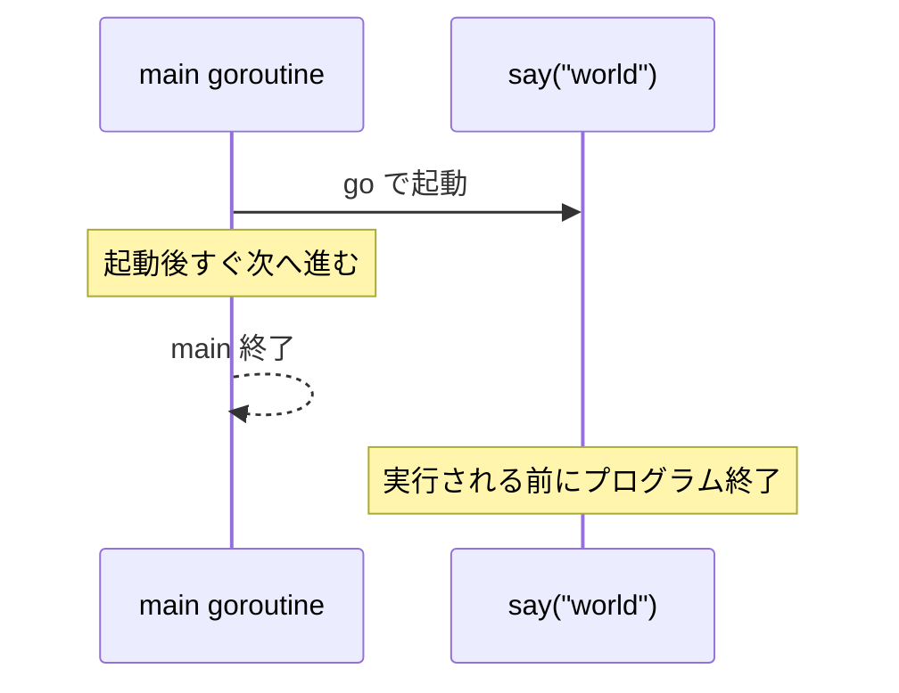

## このセクションで学ぶこと

- go キーワードで関数を goroutine として起動できる
- main が先に終わると goroutine が実行されない理由を理解する
- 簡単な終了待ち(WaitGroup)の必要性を把握する

## go を付けるだけで並行実行

goroutine の起動はとても簡単です。実行したい関数呼び出しの前に **`go` キーワード**を置くだけです。次のコードでは `say` 関数を通常呼び出しと goroutine の両方で実行しています。

```go
package main

import (
	"fmt"
	"time"
)

func say(s string) {
	for i := 0; i < 3; i++ {
		fmt.Println(s)
		time.Sleep(100 * time.Millisecond)
	}
}

func main() {
	go say("world") // 別の goroutine として並行に実行
	say("hello")    // main の goroutine で実行
}
```

`go say("world")` は新しい goroutine を起動して、`say("hello")` と並行に動きます。出力は `hello` と `world` が入り混じった順序になります。go を付けた呼び出しは「起動だけして、終了を待たずに次の行へ進む」点が通常の関数呼び出しとの大きな違いです。

無名関数(関数リテラル)を使って、その場で goroutine を起動することもよく行われます。

```go
go func() {
	fmt.Println("匿名関数を並行実行")
}()
```

## main が終わると goroutine も道連れになる

ここで初学者が必ず引っかかる落とし穴があります。**`main` 関数が終了すると、まだ動いている goroutine があってもプログラム全体が即座に終了する**のです。

先ほどのコードで `say("hello")` を消し、`go say("world")` だけにすると、`main` は go の行を実行した直後に終わってしまい、`world` が一度も表示されないことがあります。goroutine が実行される前に main が先にゴールしてしまうイメージです。



## 終了を待つには WaitGroup を使う

「main が先に終わる」問題への正攻法が `sync.WaitGroup` です。`Add` で待つ数を登録し、各 goroutine の終了時に `Done` を呼び、`Wait` で全員の完了を待ちます。

```go
var wg sync.WaitGroup
wg.Add(1)
go func() {
	defer wg.Done()
	say("world")
}()
wg.Wait() // world の出力が終わるまで待つ
```

`time.Sleep` で適当に待つ方法は一見動いて見えますが、待ち時間が足りなければ取りこぼし、長すぎれば無駄になるため実務では使いません。WaitGroup の詳しい使い方は §04-04 で扱います。

## まとめ

- 関数呼び出しの前に go を付けると goroutine として並行実行される。
- main が終わると未完了の goroutine も道連れに終了する。
- 終了を確実に待つには time.Sleep ではなく sync.WaitGroup を使う。
