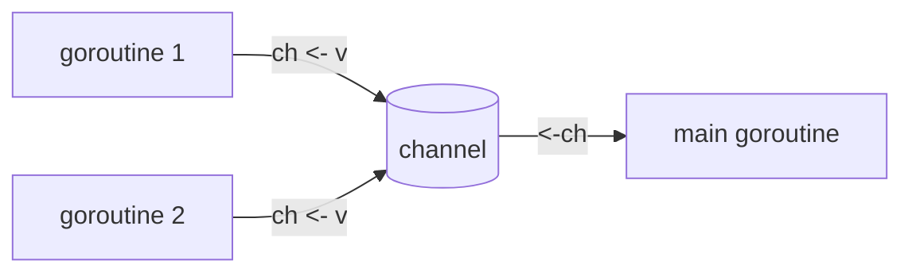

## このセクションで学ぶこと

- channel を作成して送受信できる
- channel が goroutine 間の同期も兼ねることを理解する
- close と range でデータの送り終わりを扱える

## channel は goroutine 同士をつなぐパイプ

複数の goroutine を起動できても、それらが結果を受け渡せなければ協調作業はできません。Go では共有変数をロックで守るのではなく、**channel** という型付きのパイプでデータをやり取りすることが推奨されます。「メモリを共有して通信するのではなく、通信してメモリを共有する」という Go の設計思想を体現する仕組みです。

channel は `make` で作成し、送受信には矢印型の **`<-` 演算子**を使います。

```go
ch := make(chan int) // int を流す channel
ch <- 42             // 送信(channel に値を入れる)
v := <-ch            // 受信(channel から値を取り出す)
```

下の図のように、複数の goroutine が 1 本の channel を介してデータを集約する、といった構成がよく使われます。



## channel は同期も担う

channel の重要な性質は、送受信が**ブロック(待ち合わせ)する**ことです。バッファのない channel では、送信側は受信側が値を受け取るまで待ち、受信側は値が送られてくるまで待ちます。この性質のおかげで、channel は単なるデータの通り道であると同時に、goroutine 間の**同期の道具**にもなります。

次のコードは goroutine で計算した合計を channel 経由で受け取る例です。`<-ch` が値を受け取るまで `main` は自然に待つため、§04-02 で見た WaitGroup を使わずに終了待ちが実現できています。

```go
func sum(nums []int, ch chan int) {
	total := 0
	for _, n := range nums {
		total += n
	}
	ch <- total // 結果を送信
}

func main() {
	ch := make(chan int)
	go sum([]int{1, 2, 3}, ch)
	go sum([]int{4, 5, 6}, ch)
	a, b := <-ch, <-ch // 2 つの結果を受信(届くまで待つ)
	fmt.Println(a, b, a+b)
}
```

## close と range、そして注意点

送る側が「もうこれ以上送らない」ことを伝えるには `close(ch)` を呼びます。受信側は `for v := range ch` と書くと、channel が閉じられるまで届いた値を順に受け取れます。

```go
go func() {
	for i := 0; i < 3; i++ {
		ch <- i
	}
	close(ch) // 送信終了を通知
}()
for v := range ch { // close されるまで受信を続ける
	fmt.Println(v)
}
```

注意したいのは、**閉じた channel に送信するとパニック(panic)になる**こと、そして**誰も受信しない channel に送り続けると goroutine が永久に待ち続ける(デッドロック)**ことです。close するのは必ず送信側であり、受信側が close してはいけない、という役割分担も覚えておきましょう。

## まとめ

- channel は make で作る型付きパイプで、<- 演算子で送受信する。
- 送受信はブロックするため、channel はデータ受け渡しと同期を兼ねる。
- 送信側が close し、受信側は range で受け取る。閉じた channel への送信は panic になる。
