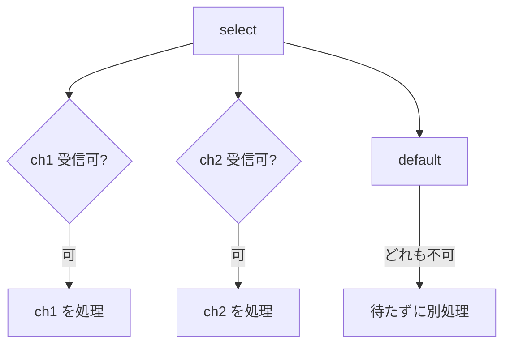

## このセクションで学ぶこと

- sync.WaitGroup で複数 goroutine の終了を待てる
- sync.Mutex で共有データを保護できる
- select で複数 channel を待ち受けられる

## WaitGroup で「全員待ち」を確実にする

§04-02 で触れた `sync.WaitGroup` は、複数の goroutine の終了を待ち合わせる定番の道具です。`Add(n)` で待つ数を登録し、各 goroutine が終わるときに `Done()` を呼び、`Wait()` で全員の完了を待ちます。`Done` は処理の最後に確実に呼ばれるよう `defer` と組み合わせるのが定石です。

```go
var wg sync.WaitGroup
for i := 0; i < 3; i++ {
	wg.Add(1)
	go func(id int) {
		defer wg.Done()
		fmt.Println("worker", id)
	}(i)
}
wg.Wait() // 3 つすべてが終わるまで待つ
```

ループ変数 `i` を goroutine にそのまま渡さず、引数 `id` として渡している点に注目してください。共有変数の競合を避けるためのよくある書き方です。

## Mutex で共有データを守る

複数の goroutine が同じ変数を同時に書き換えると、**データ競合(data race)**が起きて結果が壊れます。channel で受け渡すのが Go 流の基本ですが、カウンタのような単純な共有状態には `sync.Mutex` による排他ロックが手軽です。`Lock` と `Unlock` で挟んだ区間は、同時に 1 つの goroutine しか実行できなくなります。

```go
var mu sync.Mutex
count := 0
// 各 goroutine 内で:
mu.Lock()
count++
mu.Unlock()
```

`go run -race` のように `-race` フラグを付けて実行すると、データ競合を検出できます。並行処理を書いたら一度は race detector を通す習慣をつけると安心です。

## select で複数の channel を待ち受ける

複数の channel のうち「準備できたものを処理する」には **`select`** を使います。`switch` に似た構文で、受信または送信が可能になった `case` が選ばれます。



```go
select {
case v := <-ch1:
	fmt.Println("ch1:", v)
case v := <-ch2:
	fmt.Println("ch2:", v)
default:
	fmt.Println("どちらもまだ")
}
```

`default` を書くと、どの channel も準備できていないときにブロックせず即座に `default` へ進みます。`default` を省くと、いずれかの case が準備できるまで待ちます。タイムアウト処理は `time.After` を返す channel を case に加えるのが定番です。

## まとめ

- sync.WaitGroup の Add / Done / Wait で複数 goroutine の終了を待ち合わせる。
- 共有データは sync.Mutex で保護し、-race フラグで競合を検出する。
- select で複数 channel を待ち受け、default でブロックを回避できる。
