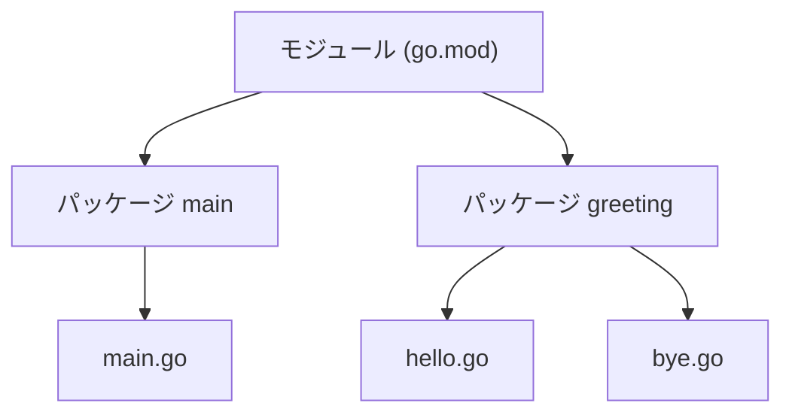

## このセクションで学ぶこと

- パッケージが「コードをまとめる単位」であることを理解する
- `package` 宣言と main パッケージ・ライブラリパッケージの違いを説明できる
- 大文字始まりで公開・小文字始まりで非公開になるルールを理解する

## パッケージはコードをまとめる単位

Go では、すべてのソースファイルが必ずどれかの **パッケージ** に属します。ファイルの先頭に書く `package 名前` がその宣言で、これがないファイルはコンパイルできません。パッケージは「関連するコードをひとまとめにして名前を付ける」仕組みで、他のプログラミング言語のモジュールやネームスペースに近い役割を持ちます。

重要なルールとして、**同じディレクトリに置かれた Go ファイルは、すべて同じパッケージ名でなければなりません**。逆に言えば、1 つのディレクトリが 1 つのパッケージに対応します。ファイルを複数に分けても、同じディレクトリにあれば中身は 1 つのパッケージとして扱われ、互いの関数や変数を自由に呼び出せます。

```
mathutil/        ← ディレクトリ = パッケージ mathutil
  add.go         package mathutil
  sub.go         package mathutil
```

## main パッケージとライブラリパッケージ

パッケージには大きく 2 種類あります。1 つは `package main` で、これは **実行可能なプログラムの入り口** になる特別なパッケージです。`main` パッケージの中に `func main()` を書くと、そこからプログラムが始まります。

もう 1 つは、それ以外の名前を持つ **ライブラリパッケージ** です。こちらは単体では実行できず、他のパッケージから `import` されて使われる「部品」になります。後で学ぶ標準ライブラリの `fmt` や `strings` も、すべてこのライブラリパッケージです。

```go
// 実行されるプログラム
package main

import "fmt"

func main() {
    fmt.Println("Hello")
}
```

```go
// 部品として import されるライブラリ
package greeting

func Hello() string {
    return "Hello"
}
```

## 公開と非公開は名前の先頭で決まる

Go には `public` や `private` といったキーワードがありません。代わりに、**識別子(関数・変数・型など)の先頭が大文字かどうか** で公開範囲が決まります。

- 先頭が **大文字** → エクスポートされ、パッケージの外から参照できる(例: `fmt.Println`)
- 先頭が **小文字** → そのパッケージ内でのみ使える(外からは見えない)

この単純なルールのおかげで、名前を見ただけで「外部に公開された API か、内部実装か」がひと目で分かります。

次のセクションで詳しく扱うモジュールも含めて、全体の階層関係を整理すると次のようになります。モジュールが複数のパッケージを束ね、パッケージが複数のファイルを束ねる、という入れ子構造です。



## 注意点

ありがちなつまずきが「同じディレクトリに別々のパッケージ名を書いてしまう」ことです。1 ディレクトリ 1 パッケージが鉄則なので、`package main` と `package util` を同じフォルダに混在させるとビルドエラーになります。また、外から使ってほしい関数を小文字で書いてしまい「import したのに呼べない」と悩むケースも多いので、公開したい識別子は必ず大文字で始めましょう。

## まとめ

- パッケージはコードをまとめる単位で、1 ディレクトリ = 1 パッケージ。
- `package main` は実行プログラムの入り口、それ以外は import される部品。
- 識別子の先頭が大文字なら公開、小文字なら非公開になる。
