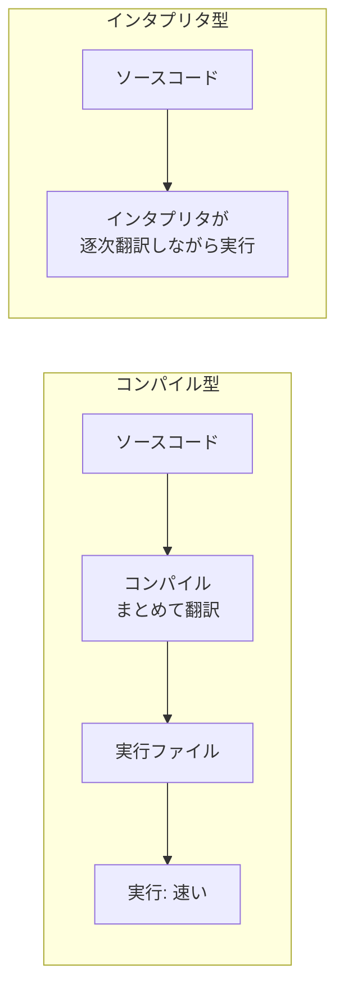

## このセクションで学ぶこと

- ソースコードがそのまま動くわけではないこと
- コンパイル型は事前にまとめて機械語へ翻訳すること
- インタプリタ型は実行しながら逐次翻訳すること

## ソースコードは「そのまま」では動かない

私たちが書くプログラム、つまり**ソースコード**は、人間が読み書きしやすい言葉で書かれています。しかし CPU が直接理解できるのは**機械語**と呼ばれる 0 と 1 の並びだけです。つまり、書いたコードを動かすには、人間の言葉からコンピュータの言葉へ「翻訳」する工程が必ず必要になります。

この翻訳のタイミングと方式の違いが、言語を分ける大きな軸の一つです。大きく分けて、**実行前にまとめて翻訳するコンパイル型**と、**実行しながら逐次翻訳するインタプリタ型**があります。

## コンパイル型 ― 先にまとめて翻訳する

コンパイル型の言語では、実行する前に**コンパイル**という工程を通します。ソースコード全体を一度に機械語(や近い形式)へ翻訳し、実行用のファイルを作ってから動かします。代表例は C、C++、Go などです。

翻訳を先に済ませてあるので、実行時には翻訳の手間がなく、**動作が速い**のが強みです。また、コンパイルの段階で文法ミスや明らかな間違いを見つけてくれるため、動かす前に問題に気づけます。一方で、コードを少し直すたびにコンパイルし直す必要があり、書いてすぐ試すという手軽さはやや劣ります。

## インタプリタ型 ― 動かしながら翻訳する

インタプリタ型の言語では、**インタプリタ**という仕組みがソースコードを実行しながら一行ずつ翻訳して動かします。代表例は Python、Ruby、JavaScript などです。

事前のコンパイルが要らないので、書いたコードをすぐ実行して結果を確かめられます。試行錯誤が多い場面や学習時には、この手軽さが大きな利点です。反面、実行のたびに翻訳しながら動くため、コンパイル型に比べると**実行速度は遅くなりがち**です。

## 流れを図で対比する

両者の違いを、ソースコードから実行までの流れで並べてみます。

## 注意点 ― 「型」はきれいに二分できないこともある

「コンパイル型かインタプリタ型か」は便利な分け方ですが、現実には中間的な仕組みも多くあります。たとえば Java はソースコードを一度「中間的な形」に変換し、それを専用の環境が実行します。コンパイルとインタプリタの両方の性質を持つわけです。また、同じ言語でも実行を高速化する工夫を後から取り入れたものもあります。

ですから、この分類は**おおまかな見取り図**として使うのが正解です。「だいたいコンパイル寄り」「だいたいインタプリタ寄り」と捉えておけば、新しい言語に出会ったときも速度や手軽さの傾向を予想しやすくなります。

## まとめ

- ソースコードは機械語へ翻訳されて初めて動く。
- コンパイル型は事前翻訳で速く、インタプリタ型は逐次翻訳で手軽。
- 二分は目安であり、中間的な仕組みも多い。
