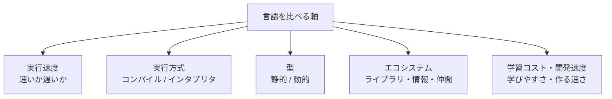

## このセクションで学ぶこと

- 実行速度のほかにも言語を比べる軸があること
- エコシステム(ライブラリ・情報)の充実が開発効率を左右すること
- 学習コストと開発速度も重要な判断材料であること

## 速度だけで言語は選べない

ここまでで「実行方式」と「型」という二つの軸を見てきました。これに「実行速度」を加えると、つい速い言語ほど良いと考えたくなります。しかし実務では、**速度以外の軸**が決め手になることがとても多いのです。プログラムが少し遅くても問題ない場面は山ほどありますが、開発が進まなければ何も完成しません。

そこで、速度に加えて知っておきたいのが**エコシステム**と**学習コスト・開発速度**という軸です。これらを合わせると、言語選びの判断材料がそろいます。

## エコシステム ― 言語のまわりに育つ環境

**エコシステム**とは、その言語のまわりに育った**ライブラリ**やツール、解説記事、コミュニティなどの総体を指します。ライブラリとは、よく使う機能をまとめた再利用可能な部品で、これが豊富なら自分で一から書く量が減ります。

たとえばデータ分析をしたいとき、必要な計算やグラフ描画の部品がそろっている言語なら、数行で目的を達成できます。逆に、やりたいことに合うライブラリが乏しい言語では、同じことを実現するのに何倍もの手間がかかります。困ったときに検索して解決例が見つかるかどうかも、情報量というエコシステムの一部です。**実行速度が同じでも、エコシステムの差で開発効率は大きく変わります**。

## 学習コストと開発速度

**学習コスト**は、その言語を使えるようになるまでにかかる手間や時間です。文法が素直で覚えることが少ない言語は、初学者が短期間で書けるようになります。一方、性能を引き出すために細かい知識を求める言語は、習熟までに時間がかかります。

これと近いのが、書いてから動かすまでの**開発速度**です。試行錯誤を素早く回せる言語は、アイデアを形にするまでが速くなります。チームの経験や納期によっては、実行が多少遅くても、早く作れて学びやすい言語が最良の選択になります。

## 比較軸を一枚に整理する

ここまでの軸を関係図にまとめます。言語を見るときの「ものさし」として持ち歩いてください。

## 注意点 ― 軸は単独でなく組み合わせで見る

これらの軸は、どれか一つだけを見て判断するものではありません。たとえば「実行は遅いが、ライブラリが豊富で学習コストが低い」言語は、データ分析や試作で非常に強いといえます。逆に「学習コストは高いが、速くて型も安全」な言語は、大規模で性能が重要なシステムに向きます。

大切なのは、**用途に対してどの軸を優先するか**を先に決めることです。軸を組み合わせて見れば、次の章から登場する具体的な言語たちも、同じものさしで素早く位置づけられるようになります。

## まとめ

- 言語は実行速度だけでなく、複数の軸で比較する。
- エコシステムの充実は開発効率を大きく左右する。
- 学習コストと開発速度も重要で、用途ごとに優先する軸を決める。
