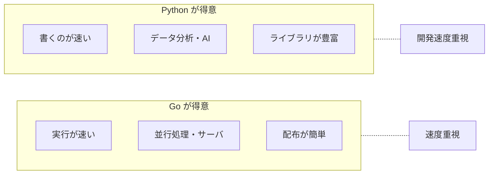

## このセクションで学ぶこと

- 用途に応じて Go と Python のどちらが向くかを判断できる
- 速度・ライブラリ・規模という観点で選び分けられる
- 両言語を組み合わせて使う発想を持てる

## 選び分けの基本

ここまでの内容を踏まえると、Go と Python は **対照的な強みを持つペア** だと分かります。どちらを選ぶかは「どちらが優れているか」ではなく、**目の前の用途がどちらの強みに合うか** で決めます。下の図は、両言語の得意・不得意を対比したものです。

判断の手がかりは、おおむね次の 3 つです。

- **速度が要るか**: 大量のリクエストを高速にさばくサーバや、長く動かし続ける裏方のプログラムなら Go。実行が速く、配布も単一バイナリで済むため運用が楽です。
- **ライブラリが決め手か**: データ分析・AI・自動化のように既製部品が物を言う分野なら Python。やりたいことに合う部品がそろっていれば、開発時間を大きく短縮できます。
- **作る速さを優先するか**: とにかく早く動かして試したいなら Python。型宣言やコンパイルの手間がなく、思いついた処理をすぐ確かめられます。

この 3 つは、第 1 章で見た「速度」「エコシステム」「学習コスト・開発速度」という比較軸を、Go と Python という具体的な 2 言語に当てはめ直したものだと考えると分かりやすいでしょう。どの軸を優先するかが決まれば、おのずと候補は絞られます。

## 具体例: 用途から考える

具体的な場面に当てはめてみましょう。

- **API サーバや マイクロサービス**: 多数のアクセスを速くさばきたいので **Go** が第一候補です。配布が単一バイナリで済む点も運用で効きます。
- **データ分析・機械学習**: `pandas` や `PyTorch` などライブラリの充実が決定的なので **Python** 一択に近い場面です。
- **ちょっとした自動化やプロトタイプ**: 手早く書いて結果を見たいので **Python** が向きます。試作から育てて、速度が必要になった部分だけ後で Go に置き換える、という進め方もよく取られます。

## 注意点

「Go か Python か」は二者択一とは限りません。実際の現場では、**分析や前処理は Python、本番でさばく部分は Go** というように、両者を役割分担させることもよくあります。たとえば機械学習モデルの実験は Python で進め、できあがった仕組みを大量のアクセスにさらすサーバ部分だけ Go で組む、といった分担です。1 つの言語にすべてを任せようとせず、強みのある言語に得意な仕事を振る、という発想を持つと選択に迷いにくくなります。

最終的には、チームが慣れている言語かどうかも現実的な判断材料になります。どれだけ理屈の上で最適でも、誰も書けない言語では開発は進みません。「用途に合う強み」と「チームの習熟」の両方を見て選ぶ、という姿勢を持っておきましょう。

## まとめ

- 速度・サーバ用途なら Go、ライブラリ・分析・試作なら Python。
- 「どちらが上」ではなく、用途がどちらの強みに合うかで選ぶ。
- 二択にせず、両言語を役割分担させる発想も有効。
